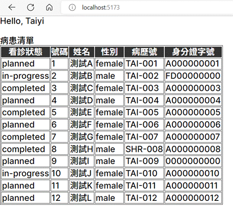
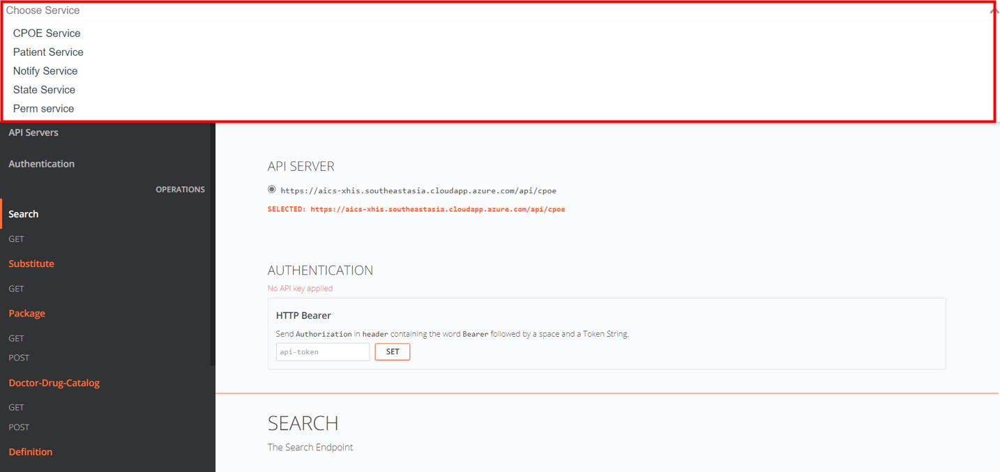
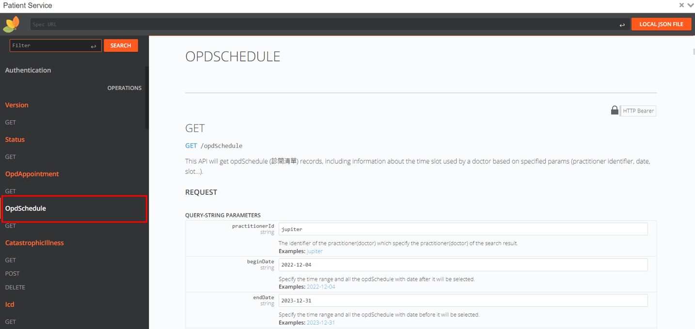

# Environment Setup

## Goal

Understand how to setup a local developing environment and run a basic "Hello World" program.

## Material

Developing xHIS widgets is highly dependent on our xHIS backend services, therefore, we provided a testing server which simulates the results of API calls for developers who want to locally test their widgets. Developers will need to get a developer token to access our testing server.

## Steps

**Step 1**: Request a developer token (<jim1_lin@asus.com>)

**Step 2**: Clone our tutorial sample code

```sh
git clone https://github.com/ASUS-AICS/xhis-frontend-sample.git
```

**Step 3**: Initialize the tutorial environment

```sh
npm i
```

The above commend will download the necessary npm packages and then create a `.env.local` file in the root of this tutorial project folder.

In the `.env.local` file, there are two variables:

- `VITE_WIDGET_SDK_BACKEND_URL` is the URL of our testing server.
- `VITE_WIDGET_SDK_DEV_TOKEN` is the developer token, which is empty by default (please see the following step to know how to config it).
- `UPLOAD_WIDGET_API_KEY=` is the upload widget token, which give you the access to upload your own widget to our layout editor in tutorial4.

**Step 4**: Config developer token

Copy and paste the developer token (you got from step 1) into the `.env.local` file. The insert position is right after the `VITE_WIDGET_SDK_DEV_TOKEN=`, also insert the upload widget token after the `UPLOAD_WIDGET_API_KEY=`.

**Step 5**: Run local dev server

```sh
npm run dev
```

**Step 6**: Open browser with the link: <http://localhost:5173/>. You will see a Tutorial selecting page and please select Tutorial 1.

> Notice that you must browse <http://localhost:5173/> instead of <http://127.0.0.1:5173/>, or you will encounter a CORS error when making an API request.

You will see the following results, where "Taiyi" is your developer user name and the patient list is the sample data got from our testing server.



**Step 7**: Trace the code for this tutorial

Please open `src/tutorials/tutorial_1/HelloWorld.vue` to see the sample codes for the tutorial 1.

<<< @/../src/tutorials/tutorial_1/HelloWorld.vue

## What you have learned

- Node and npm environment setup
- Understand the basic file structure of this Widget SDK tutorial repository
- How to make a backend API request

## Assignments

1. Follow the material and setup the local environment.
2. Create a simple form, make the **date time**, **time slot**, and **subject** are switchable. You can consider using HTML native elements such as `<input type="date"/>` and `<select/>` to create this form for now, and bind values with `v-model` directive.
   
3. Try to access **opdSchedule** API by the following sample to get opd schedule (診間清單) records. Then fetch new patient list by calling **opdAppointment** when `encounterDate`, `slot` or `subjectId` changes.

### API spec of **opdSchedule**

- Api: [GET `admin/opdSchedule`](https://xhis-docs.azurewebsites.net/main#tag--opdSchedule)

> 💡 Please note, when you click on the api link, the site will automatically redirect back to <https://xhis-docs.azurewebsites.net/main#tag--search>, it's normal due to our routing mechanism.

- At the top of the website, click on **Choose Service** and choose **Patient Service**
- After clicking, you can see **opd schedule** on the leftside menu, and other api you gonna be using during all the tutorial.




[GET] `CONSTANTS.SERVICES.OPD_SCHEDULE` query parameters:

- `practitionerId`: The identifier of the practitioner (doctor)
- `beginDate`: e.g. '2022-12-05'
- `endDate`: e.g. '2023-03-06'

Example response body:

```json{2-5}
[{
  "date": "2022-10-04T16:00:00.000Z",
  "slot": "morning",
  "subjectId": 10000,
  "subjectName": "疑難雜症科",
  "practitionerId": "jupiter",
  "practitionerName": "JUPITER",
  "roomId": 1,
  "active": "normal",
  "appointmentCount": {
    "count": 12,
    "isVisited": false
  }
}]
```

These are extra Vue Composition APIs you might need:

- [`ref()`](https://vuejs.org/api/reactivity-core.html#ref)
- [`watch()`](https://vuejs.org/api/reactivity-core.html#watchposteffect)

You can use the following constant to create the select menu for **time slot**:

```js
const slotLabelMap = {
  morning: '上午',
  afternoon: '下午',
  evening: '夜間',
};
```
