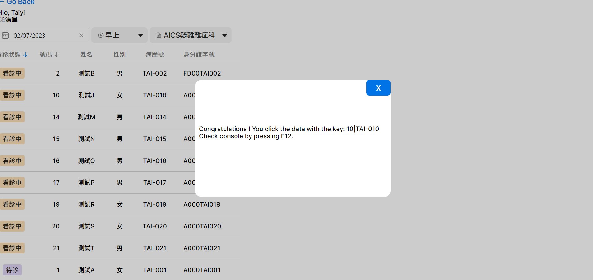
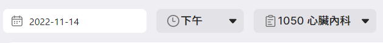

# Basic xUI components

## Goal

Understand how to use xUI to boost widget development process.

## Material

**Step 1**: check our xUI Demo & Docs: [xHIS UI - xHIS (azure.com)](https://aics-xhis.southeastasia.cloudapp.azure.com/web/xui/)

**Step 2**: Run `npm run dev` in terminal

**Step 3**: Open browser with the link: `http://localhost:5173/`. You will see a Tutorial selecting page and please select Tutorial 2.

You will see results as the following figure. In this tutorial, we replace the original HTML table with our developed `XTable`. Our `XTable` not only provide prettier UI, but also some basic functions, such as sorting by certain columns.

This tutorial will implement the patient list and the encounter status, and use xUI to implement them in the `src/tutorials/tutorial_2/PatientList.vue` and `src/tutorials/tutorial_2/PatientListCellState.vue` vue components respectively.

1. First, you can view the `XTable` document ([link](https://aics-xhis.southeastasia.cloudapp.azure.com/web/xui/?tab=XTable)) to introduce the parameters required for the implementation of the Props chapter of the document:
   - `data` prop is the data required for the render table data
   - `options` prop is to define field settings
2. Get patient list data through api:

   - First define the render data in the `PatientList` component as `patientList` vue ref, and define the field data as `tableColSchema`.

   `patientList` vue ref:

   ```js
   const patientList = ref < any > [];
   ```

   `tableColSchema (src/tutorials/tutorial_2/utils/tableOptions.ts)`:

   <<< @/../src/tutorials/tutorial_2/utils/tableOptions.ts

   - Prepare render data in the `onMounted` lifecycle hook defined in the `PatientList` component.

   `onMounted`:

   ```ts
   onMounted(async () => {
     try {
       // Get IAM information
       const me = (await api.userInformation()).data as any;
       userInfo.name = me.display_names[0]['name'];
       userInfo.id = me.idps[0]['user_id'];

       // TODOITEM: use opdSchedule to get room information
       const response = await api.serviceClient.get(CONSTANTS.SERVICES.OPD_APPOINTMENT, {
         params: RoomInfo.value,
       });
       patientList.value = response.data;
     } catch (e) {
       console.log('error: ', e);
     }
   });
   ```

   - Get user name and ID data through `api.userInformation()`.

   `api.userInformation()`:

   ```ts
   // Get IAM information
   const me = (await api.userInformation()).data as any;
   userInfo.name = me.display_names[0]['name'];
   userInfo.id = me.idps[0]['user_id'];
   ```

   - Get the patient list data through `api.serviceClient.get()`, and save it back to `patientList` vue ref.

   `api.serviceClient.get()`:

   ```ts
   const response = await api.serviceClient.get(CONSTANTS.SERVICES.OPD_APPOINTMENT, {
     params: RoomInfo.value,
   });
   patientList.value = response.data;
   ```

   - The following are the query string parameters required by the `OPD_APPOINTMENT` api.
     - `practitionerId` is the user ID
     - `slot` is the encounter slot
     - `encounterDate` is the encounter date
     - `subjectId` is the subject ID
   - The following is the field data defined in the `OPD_APPOINTMENT` api return data.
     - `encounterStatus` is the encounter status
     - `seqNo` is the encounter number
     - `patientName` is the patient name
     - `patientGender` is patient gender
     - `patientId` is patient ID
     - `patientPersonalId` is Identity card ID

3. Implement table content through `XTable` dynamic slot:

   - The encounter status field uses `#cell-encounterStatus` and passes the status prop into the `PatientListCellState` component.

   `#cell-encounterStatus`:

   ```vue
   <template #cell-encounterStatus="{ content }">
     <PatientListCellState :status="content"></PatientListCellState>
   </template>
   ```

   - First, you can view the `XTag` document ([link](https://aics-xhis.southeastasia.cloudapp.azure.com/web/xui/?tab=XTag)), and use the `theme` prop to control the tag style
   - Define the theme and display text of the encounter status
     - `completed`
       - display text is `完診`
       - theme is `green`
     - `planned`
       - display text is `待診`
       - theme is `violet`
     - `in-progress`
       - display text is `看診中`
       - theme is `orange`
     - `undefined`
       - display text is `--`
       - theme is `neutral`

   `PatientStates (src/tutorials/tutorial_2/PatientListCellState.vue)`:

   ```ts
   const PatientStates: Record<string, { name: string; theme: XColorTheme }> = {
     completed: {
       name: '完診',
       theme: 'green',
     },
     planned: {
       name: '待診',
       theme: 'violet',
     },
     'in-progress': {
       name: '看診中',
       theme: 'orange',
     },
     undefined: {
       name: '--',
       theme: 'neutral',
     },
   };
   ```

   - Transfer gender display text
     - Male displays the text as `男`
     - Female displays the text as `女`
     - Non-male and non-female display text as `未知`

   `toGenderText (src/tutorials/tutorial_2/utils/patientUtils.ts)`:

   <<< @/../src/tutorials/tutorial_2/utils/patientUtils.ts

   - Sort by encounter status

     - Set `default-sort-index` to `encounterStatus`

     `default-sort-index prop`:

     ```vue
     <XTable
       :data="patientList"
       :options="tableColSchema"
       :key-index="['seqNo', 'patientId']"
       default-sort-index="encounterStatus"
       interactive
       style="cursor: default"
       @row-click="handleRowClick"
     >
     </XTable>
     ```

     - Set the sort function in the `encounterStatus` field of tableColSchema
     - Use `generateSortFunctionFromSeq` to set the sort priority to `in-progress`, `planned`, `completed`

     `sort field (src/tutorials/tutorial_2/utils/tableOptions.ts)`:

     ```ts
     import { generateSortFunctionFromSeq } from '@asus-aics/xui';

     {
       index: 'encounterStatus',
       align: 'middle',
       title: '看診狀態',
       sort: generateSortFunctionFromSeq(['in-progress', 'planned', 'completed']),
       width: '100px',
       cellStyle: { padding: '0 8px' },
       headStyle: { padding: '0 8px' },
     }
     ```

## What you have learned

- How to lookup official xUI documents
- How to import and use xUI

## Assignments

1. Follow the material and setup the local environment.
2. Try to use `XDialogue` to show a dialogue when user click a patient on the patient list.
3. Try to use `XDateTimePicker`, `XSelect` to replace the components you made in assignments of Tutorial 1.




