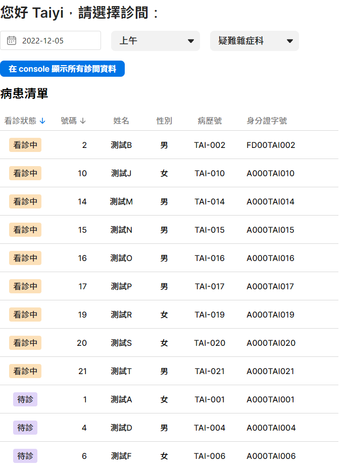
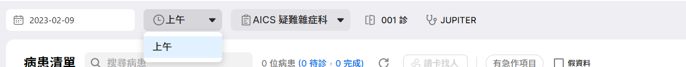
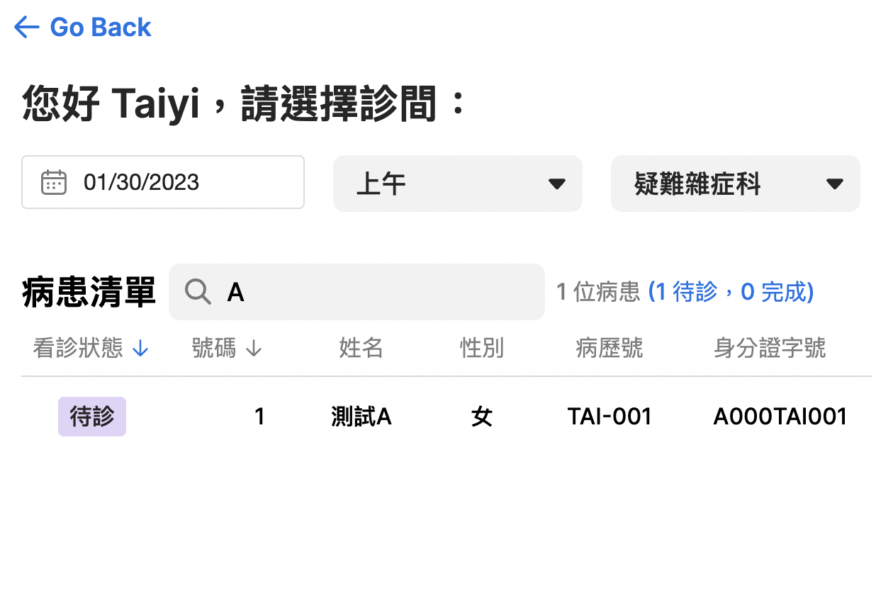

# Advanced xUI components

## Goal

Understand how to use advanced Vue and xUI concept.

We will deconstruct a big component into several composables and exploit Vue 3 composition API to create reactivity between data and components.

## Material

**Step 1**: check the following documents:

- our xUI Demo & Docs: [xHIS UI - xHIS (azure.com)](https://aics-xhis.southeastasia.cloudapp.azure.com/web/xui/)
- [Composables | Vue.js (vuejs.org)](https://vuejs.org/guide/reusability/composables.html)

**Step 2**: Run `npm run dev` in terminal

**Step 3**: Open browser with the link: <http://localhost:5173>. You will see a Tutorial selecting page and please select Tutorial 3.

You will see results as the following figure. In this tutorial, we add the following features:

::: info Figure.1
{width=50%}
:::

- **AICS CSS typography & color system**:

  - In the template section of `src/tutorials/tutorial_3/PatientList.vue`, we use our pre-defined [typography](https://aics-xhis.southeastasia.cloudapp.azure.com/web/xui/?tab=Typography) classes, you can find the title using the pre-defined class naming `xv-headline--headline-sm`.

    <<< @/../src/tutorials/tutorial_3/PatientList.vue#css1

  - In the style section, we can see a pre-defined color variable `var(--xv-text--high-emphasis-text)`. You can refer our [color](https://aics-xhis.southeastasia.cloudapp.azure.com/web/xui/?tab=Color+System) system to find more pre-defined colors.

    <<< @/../src/tutorials/tutorial_3/PatientList.vue#css2

- **Vue Composable API**:

  - In this tutorial, we added a composable folder to handle basic OPD data logics (please check this file: `src/tutorials/tutorial_3/composable/useOpdInfo.ts`). The `useOpdInfo` composable handles three OPD data structures described as follows:

    - `UserInfo`: Basic user (or doctor) information, including user name and user id.

      <<< @/../src/tutorials/tutorial_3/composable/useOpdInfo.ts#UserInfo
      <<< @/../src/tutorials/tutorial_3/composable/useOpdInfo.ts#userInfo

    - `RoomInfo`: Basic room (診間) information, which is consisted of `practitionerId` (which is user or doctor id), `slot` (e.g., morning, evening), `encounterDate`, and `subjectId` (科別 ID).

      <<< @/../src/tutorials/tutorial_3/composable/useOpdInfo.ts#RoomInfo
      <<< @/../src/tutorials/tutorial_3/composable/useOpdInfo.ts#roomInfo

    - `opdState`: The opdState can be considered as the union of the `UserInfo` and `RoomInfo`. In fact, the above two data structures are generated by the **opdState in realtime and keep reactivity** (using Vue [`computed`](https://vuejs.org/guide/essentials/computed.html#basic-example)). The `userInfo.id` is the same as `roomInfo.practitionerId`. Therefore, we can store both id into one variable (i.e., `opdState.id`) and create the derivative data structures (i.e., `userInfo` and `roomInfo`) on demand.

      <<< @/../src/tutorials/tutorial_3/composable/useOpdInfo.ts#opdState

  - Furthermore, `useOpdInfo` also provider some modifier functions, such as `setSlot`, `setSubjectId`, `setDate`, to provide public interfaces to change the opdState member fields without exposing `opdState` itself.

    <<< @/../src/tutorials/tutorial_3/composable/useOpdInfo.ts#useOpdInfo

- Other Refactors based on Tutorial 2:

  - In Tutorial 3, we also separated the logic of getting patient list from `PatientList.vue` into `usePatientList.ts` (see `src/tutorials/tutorial_3/composable/usePatientList.ts`). The patient list dependents on `roomInfo` (so we should pass it into `usePatientList` as a parameter). Every time the roomInfo got changed, the patient list will be automatically updated since we ["watch"](https://vuejs.org/guide/essentials/watchers.html) the `roomInfo`.

    <<< @/../src/tutorials/tutorial_3/composable/usePatientList.ts#getPatientList

  - As the results, the `PatientList.vue` can focus on rendering the UI and hide the detailed logics into individual composable modules.

- **API**:

  - You can use api to fetch the online data. Please refer to `./src/utils/api.ts` that is a api interface for using in your code. Please refer to API document for detail.
  - [xHIS API documentation](https://xhis-docs.azurewebsites.net/)
  - PatientList:
    - Api: [GET `admin/opdAppointment`](https://xhis-docs.azurewebsites.net/main#tag--opdAppointment)
  - ScheduleList:
    - Api: [GET `admin/opdSchedule`](https://xhis-docs.azurewebsites.net/main#tag--opdSchedule)
  - UserInfo:
    - Api: GET `iam/api/v1/users/@me`
    - Headers:

      <<< @/../src/utils/api.ts#userInformationHeaders

    - Response:

      ```json
      {
        "data": {
          "display_names": [
            { "name": "USER_NAME" }
          ],
          "idps": [
            { "user_id": "USER_ID" }
          ]
        }
      }
      ```

- **xUI**:
  - Please learn more about each xUI, and understand the reactivity between data and components, e.g `XDateTimePicker` and `XSelect` in `PatientList.vue`.
  - `xTable`:
    - please refer [xHIS UI - XTable](https://aics-xhis.southeastasia.cloudapp.azure.com/web/xui/?tab=XTable)

      <<< @/../src/tutorials/tutorial_3/PatientList.vue#XTable

    - data: use the `patientList` for main data source
    - options: `tableColSchema` is in `src/tutorials/tutorial_3/utils/tableOptions.ts`. The index columns corresponds to each table field of the patient in `patientList`.

      <<< @/../src/tutorials/tutorial_3/utils/tableOptions.ts#tableColSchema

## What you have learned

- How to deconstruct a big component into several composables
- How to exploit Vue 3 composition API to create reactivity between data and components

## Assignments

1. Follow the material and setup the local environment
2. You may note that there is a `useSchedule` composable in `tutorial_3/composable folder`. Please use the `opdSchedule` API to get rooms which actually have patients registered. The `XSelect` of `slots` and `subjects` should dynamically change their options and only show the rooms have at least one registered patient.
   - For now, the options are static variables put in `PatientList.vue` (you will find the `slotOptions` and `subjectOptions`).
   - You can check the API response by clicking the button <XButton size="sm">在 console 顯示所有診間資料</XButton> and you will see the API response are logged in the console (press F12 to open it).
   - For example if we get the data from the `admin/opdschedule` and found out there’s no paitent in `2023/02/09`,  `afternoon` and `evening`, `AICS`, then we should make sure the user can only choose `morning` as option.
    
3. Add a `usePatientFilter` composable to apply filtering patient functions by certain patient attributes (e.g., patient names or patient id numbers)

   ::: info Figure.2
   
   :::

<script setup>
  import { XButton } from "@asus-aics/xui"
</script>
