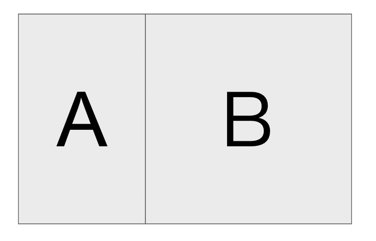
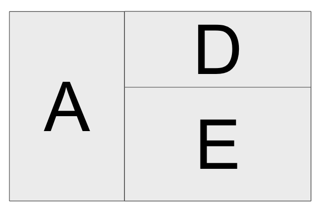
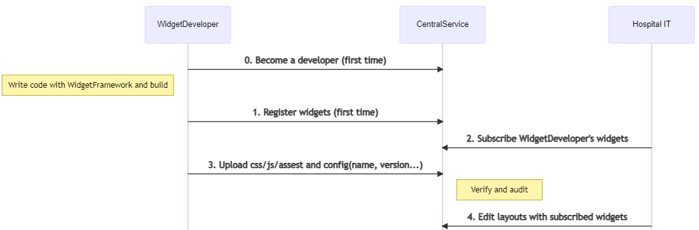
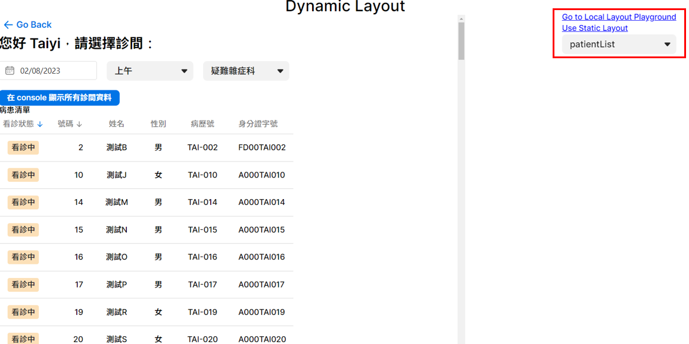
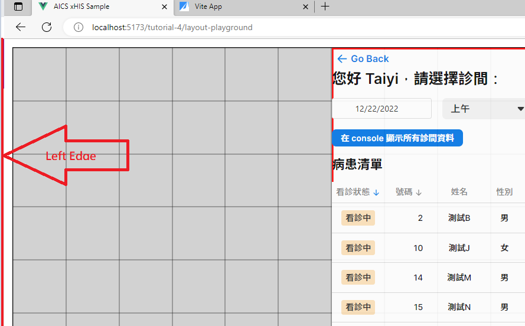
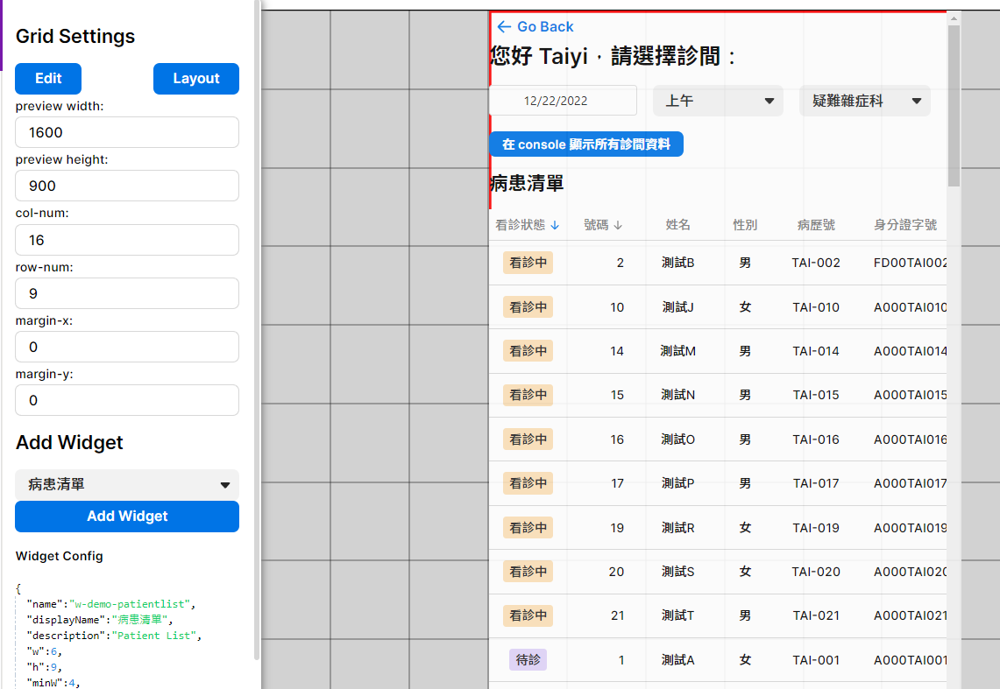
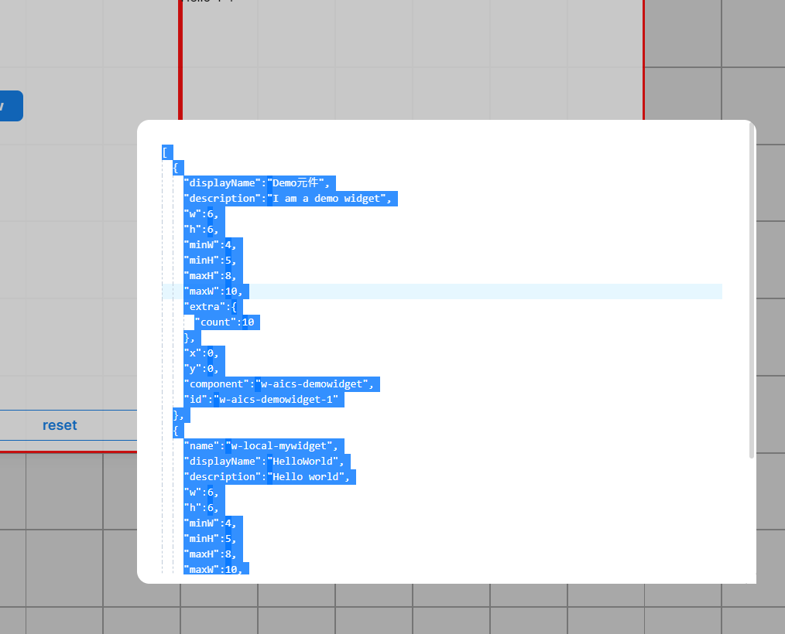
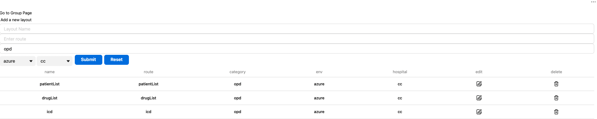
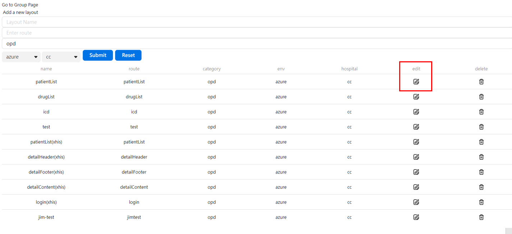
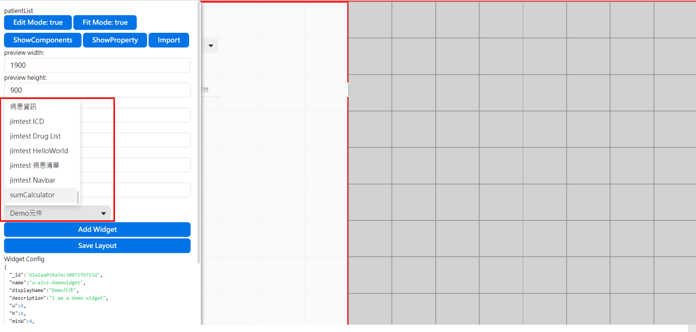

# Widget and Layout

## Introduction

In xHIS, form is not as the same as Widget, we don’t use xUI components to build a **“Form-like”** Widget, if you have the need for using Form in your application, you should build one using **Form Builder** according to this tutorial.

## Goal

Understand how to develop a widget, use Local Layout Playground, and use Static Layout on a page. After local development, developer can build and publish widgets. Then user edit layout with updated widgets, he can see the changes on tutorial pages.

## Terms Definitions

Before go through this tutorial, we introduce some terms first.

- A layout is consisted by at least one widgets,  in the following pictures, `LayoutX` consisted by `widgetA`, `widgetB` and `LayoutY` is consisted by `widgetA`, `widgetD`, `widgetE`. A widget is used by zero or multiple layout, for example, `widgetA` is used by both layout.

  ||
  |:--:|
  |`LayoutX`|

  ||
  |:--:|
  |`LayoutY`|

- Developer use layout to see or use your widgets with other widgets, hospital IT choose which widget be used in particular layout and arrange the combinations. These two kind of people's relation is like below flow.

  

## Material

- Widget developers need to know how to create widgets and also how widget can be displayed on the layout. So in this tutorial, we will introduce the followings.
  1. How to develop a widget on local
  2. See your layout on **Layout Playground**
  3. Use **Static Layout** with your widgets
  4. Build and publish your widgets
  5. Update the layout on **Layout Editor**
- This tutorial involve 4 components
  - **Local Widget Playground**: arrange your local widgets
  - **Static Layout**: use a Static Layout to render a page
  - **Dynamic Layout**: use a dynamic layout provided by layouts on Layout Editor
  - **Layout Editor**: Online Layout Editor to arrange and store layouts with published widgets

## Please follow the following steps to finish the tutorial

> 💡 Set `VITE_TUTORIAL_INDEX=4` on `.env.local`

### Develope a widget and use Local Widget Playground

1. Open browser for Tutorial 4.  Click `Go to Local Layout Playground` on right hand side. By default setting, you will see a `patientList` widget on a editable layout.

   

2. Move your mouse cursor to the left edge of the page and there will be a setting panel. The widget bellow is width `600px` (6*100) and height `900px`, due to preview width is `1600`, `col-num` equal to `16` so that each grid's width is `100px` and this widget's width is `6`.

   

   

3. The unit of `w/h/minW/minH/maxW/maxH` are `grid num`. Open `src/tutorials/tutorial_4/widgets/myWidget/config.ts` to see the comments for more explanations.
4. You can develop your widget under `src/tutorials/tutorial_4/widgets`. Let's update the title in `src/tutorials/tutorial_4/widgets/myWidget/myWidget.vue:14` to `Hi World`. After refresh the web and add `myWidget` into playground. You can see the title changed on Local Widget Playground.

   <<< @/../src/tutorials/tutorial_4/widgets/myWidget/myWidget.vue#MyWidgetSetting{6 ts}

### Use Static Layout with your widgets

1. Before use Static Layout, modify the layout on Local Widget Playground to what you want. Let's copy the layout setting after click `layout` button on setting panel.

   ||
   |:--:|
   |Layout Config|

2. Go back Tutorial 4 and click `Use Static Layout`.
3. You can see there is a layout constructed by widgets. To use your local layout, replace the `config`(`layoutComponents`) in `src/tutorials/tutorial_4/StaticLayout vue:32` by what copied at step 1. (be careful of the brackets)

   <<< @/../src/tutorials/tutorial_4/StaticLayout.vue#StaticLayoutSetting{10-23 ts}

4. Refresh the web, you can see the page changed on Static Layout.

### Build and publish your widgets

For now, you can develop widget and render the page with layout constructed by widgets on local. For the following steps, you will build and publish the widgets to cloud, and edit layout on Layout Editor.

1. Run command `npm run build-widgets`. If there are any error, please check the config files are valid.

2. If there are no errors on build step, run command `npm run publish-widgets VERSION`, `VERSION` is any string you want.
   - If you encounter the following response on your terminal

      ```sh
      ....a lot of messages above
         data: {
               name: 'NotAuthenticated',
               message: 'API Key is not matched',
               code: 401,
               className: 'not-authenticated',
               errors: {}
            }
         },
         isAxiosError: true,
         toJSON: [Function: toJSON]
      }
      ```

   - Set your `UPLOAD_WIDGET_API_KEY` in `.env.local` (Please contact <jim1_lin@asus.com> if you wan to register the token)

### Update the layout on Layout Editor

1. Go to [Layout Editor](https://xhis-playground-dev.southeastasia.cloudapp.azure.com/web/widget/),  you can see there are many layouts including `patientList`, `icd` and `drugList`.

   

2. Click `edit` on `patientList`, you can adjust the layout then save the layout.

3. Go back to Tutorial 4 `Dynamic Layout` (needed refresh), you can see your modified layout!

## What you have learned

- Understand how to develop a widget with widget SDK.
- Able to render a Static Layout on local.
- Able to build then publish widgets to the cloud.
- Able to modify layout on Layout Editor(online).
- Able to use a layout which configured on Layout Editor (online).

## Assignment

1. Add a new widget under `src/tutorials/tutorial_4/widgets`. (Please remeber to set the `config.ts` and `index.ts` for widget to work)
2. Use Static Layout with your new widget.
3. Publish your new widget and add it to an existed layout.
4. After publishing, you can click the `edit` button on random layout, then move your mouse cursor to the left edge of the page and there will be a setting panel, and found the widgets you upload when select the `Add Widget` options.




