# Rule Engine

## Goal

Understand how to trigger rules with specific `TriggerType` and how to handle actions in rule result.

In order to meet requirements from each hospital, xHIS provides the abitlity to customize logics and related actions on specific trigger points. Advanced widget developer should know how to work with Rule Engine for their widgets.

### Trigger Types

If your widget's functionality includes below trigger type, your widget must call rule engine and handle the related result.

- `ADD_DRUG`: before add drug
- `ADD_ORDER`: before add order
- `ADD_ICD`: before add ICD
- `EDIT_DRUG`: after update drug list (including just add drug)
- `EDIT_ORDER`: after update order list (including just add order)
- `EDIT_ICD`: after update icd list (including just add icd)
- `LOGIN_OPD`: after login
- `ID_FORM_INITIALIZE`: id form initialization and click patient on paitent list and open id form setting
- `ID_FORM_CHANGE`: after update idForm data
- `ENCOUNTER_INITIALIZE`: after user just into patient details
- `TEMPORARY_SAVE`: after user click temporary save on patient detail
- `ENCOUNTER_DONE_CHANGE_VALUE`: encounter done - change value
- `ENCOUNTER_DONE_BACK_TO_ENCOUNTER`: encounter done - back to encounter
- `ENCOUNTER_DONE_NOTICE`: encounter done - notice
- `ENCOUNTER_DONE_SPECIAL_CODE`: encounter done - user just click encounter done
- `PACKAGE_DRUG_VALUE_CHANGED`: after package drug list changed
- `PACKAGE_ORDER_VALUE_CHANGED`: after package order list changed

## Material

There are 2 core part to use Rule Engine, the first one is how to execute rules by SDK, and the other is how to receive and handle the result from Rule Engine. The following steps will introduce how to execute rules, how to handle results and how to use `Custom Action`

>💡 Before go through this tutorial, please update the variable `VITE_TUTORIAL_INDEX=5` in `.env.local`.

### How to execute rules by SDK

1. In tutorial 4, we already provide some widgets, including `icdList` and `drugList`. These 2 widget must cooperate with rule engine, so we add the code for these widget to use rule engine. The following are 2 different trigger types for rule
   - ADD_DRUG`src/tutorials/tutorial_5/widgets/drugList/drugList.vue:L456`

   <<< @/../src/tutorials/tutorial_5/widgets/drugList/drugList.vue#addDrug{ts}

   - ADD_ICD: `src/tutorials/tutorial_5/widgets/icd/utils/useIcdData.ts:L268`

   <<< @/../src/tutorials/tutorial_5/widgets/icd/utils/useIcdData.ts#addICD{ts}

### How to Handle Rule Results

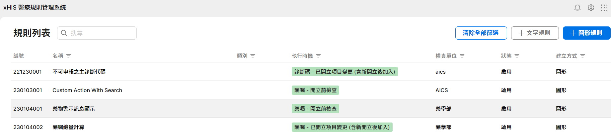

1. Before introduce how to handle rule result, we take a look on [Rule Configurator](https://xhis-playground-dev.southeastasia.cloudapp.azure.com/web/rule/) for a simple rule. After login, double click "藥物警示訊息顯示". You will see this rule is composed by one "Decision" and one "Process". The trigger type of this rule is "藥囑開立前檢查".
   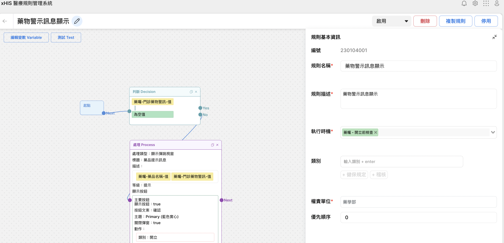

2. The explaination of this rule is that when prescribing a drug which "門診藥物警訊" is not empty show a dialogue. The dialogue will show the "藥品名稱" and related "門診藥物警訊". There is one button "確認" to confirm the prescribe.
3. Let's go back to Tutorial 5, and try to trigger this rule. Because the rule's trigger type is "藥囑-開立前檢查", we choose any patient and enter to the drug page.
   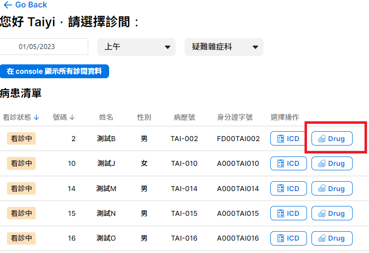

4. There is a drug's "門診藥物警訊" is not empty which named`Chlorhexidine Liq (藍色) 2% 200ml Bot`, so paste this name into search bar and click this drug to prescribe this durg into drug list.

   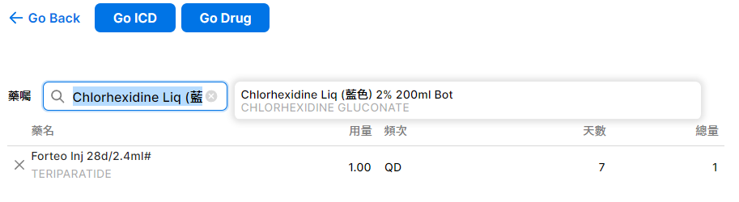

5. There will be a small delay, you will show a dialogue just like below picture. The format of this dialogue will as same as what the rule configures.

   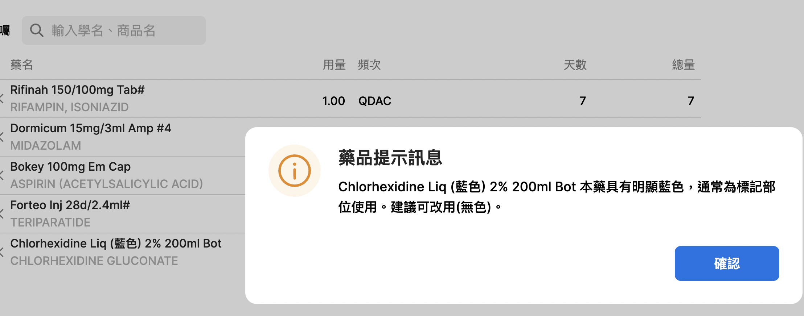

6. Above example is a one-time action, it will not keep any state on the widget. In some cases we need to leave some error messages on the widget. The following steps will introduce a rule example to explain how inline error message works on ICD list
7. click [link](https://xhis-playground-dev.southeastasia.cloudapp.azure.com/web/rule/rule-editor?serialNo=221230001) to see another example, this is a rule which triggers when icd list changed. The rule's meaning is when "限制代碼" in "主診斷" contains "Ｎ" show the inline message "this icd code cannot be '主診斷'"

   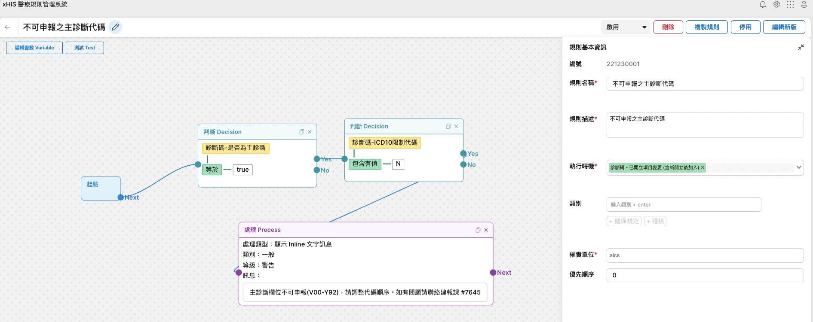

8. Go back to patient list again and click icd on any patient. To trigger this rule, there is a ICD `V00.01XA` which its 限制代碼 contains "Ｎ". Search it and click it then update the ICD list to let this ICD become "主診斷"
   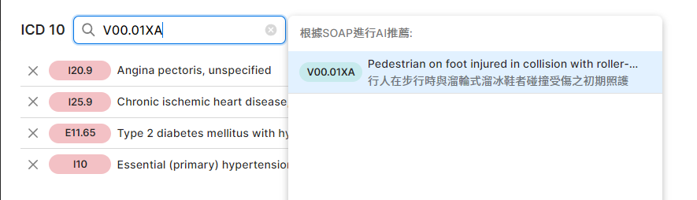

9. Please drag this ICD to first, and you will see a read inline message.

   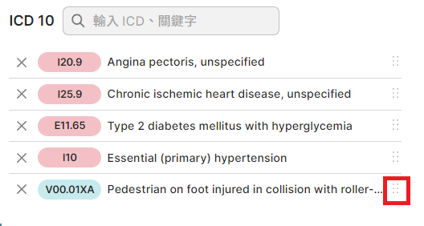

   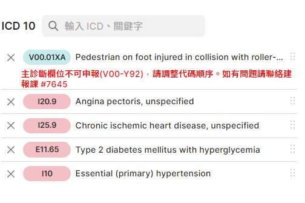

10. `errorList` is one of `ICD`'s attribute, in this case the inline message will be set in this attribute. The code example is in `src/tutorials/tutorial_5/widgets/icd/utils/useIcdData.ts:169`：

    <<< @/../src/tutorials/tutorial_5/widgets/icd/utils/useIcdData.ts#ShowNotification

    - In fact, we didn't acutally handle the corresponding frontend action on `Rule Configurator`, we handle the logic on frontend according to the rule we got from the backend, as for the position of getting the rule from `Rule Configurator`, please see the following:
  
    <<< @/../src/tutorials/tutorial_5/widgets/icd/utils/useIcdData.ts#runAddIcdRules

    - We get the rule you set on `Rule Configurator` from `api.runRule`, then keep processing the data and logic to `handler['showNotificaiton']`, you can understand more about how this works by tracing above code in the tutorial.

11. Above case is to show the inline message, but we also need to clear this message. To clear this message we need to handle the result when the condition is not matched. To handle this situation, there is a sepecial action called `NoResult`. When widget receive this action, you need to clear the error according to `rulePath`. The following code example(`src/tutorials/tutorial_5/widgets/icd/utils/useIcdData.ts:L144`) is to clear `errorList` in `icd`:

    <<< @/../src/tutorials/tutorial_5/widgets/icd/utils/useIcdData.ts#NoResult

12. So we move this icd to another order rather than fist position, the message will be clear.

### How to Use Custom Action

There are only limited actions provided by Rule Engine. These actions cannot fit all requirement from rules. So we provide a mechanism to add custom action, and developer able to upload his action and handle this action on their own widgets.

Suppose there is a requirement that there are some special drugs be added into drug list then show the information for this drug. The following will show how to add a custom action that open a Google Search Result with keyword by this drug name.

#### The following introduce how to create a rule, and this rule will use a custom action "開啟搜尋頁面"

1. Go back to [Rule Configurator](https://xhis-playground-dev.southeastasia.cloudapp.azure.com/web/rule/), click "＋圖形規則" to add a new rule.

   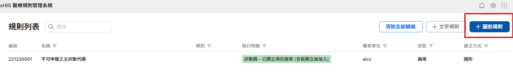

2. Fill in the content into the fields on "規則基本訊息"

   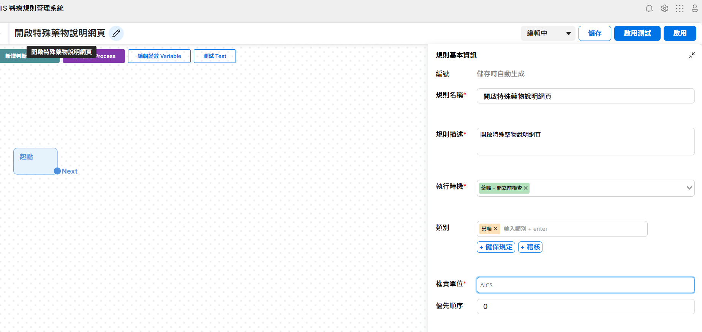

3. Click "新增判斷", then there is a condiction block. Click this block set it to to **"when 藥囑代碼 is one of `["XYZ01O", "BOK01O"]`**.
   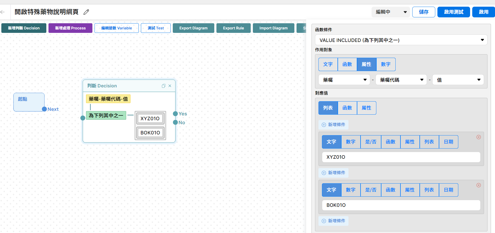

4. After added condition, we add action afterwards. 設定好判斷後，接下來我們要設定 Action. Before that, we must add the custom action first. This feature will coming soon and now is in dev mode. Open the developer mode(press F12) and go to "console" tab. Next, enter `document.debugRuleEditor()`. Click
Import Action Config", you will see a popup window：

   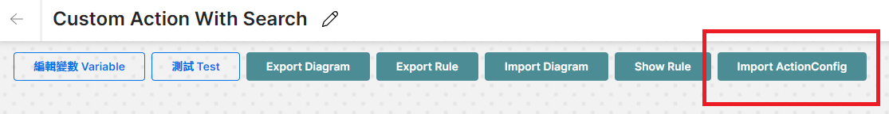

   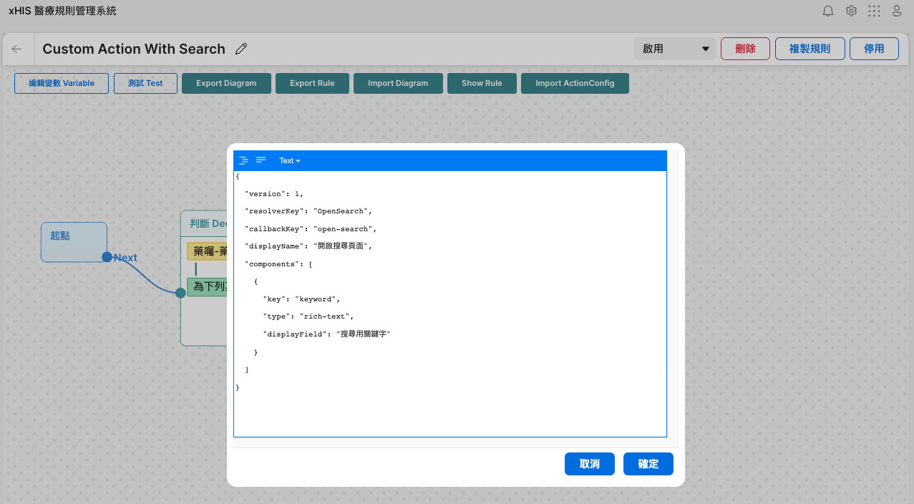

5. Paste bellow config into it then click ok.

   ```json
   {
     "version": 1,
     "resolverKey": "OpenSearch",
     "callbackKey": "open-search",
     "displayName": "開啟搜尋頁面",
     "components": [
       {
         "key": "keyword",
         "type": "rich-text",
         "displayField": "搜尋用關鍵字"
       }
     ]
   }
   ```

6. You can see there is a new action named "開啟搜尋頁面" after you click "新增處理 Process". "開啟搜尋頁面" is the `displayName` in above config.
7. In this case, there are 2 drugs will be used to show the search result. So we need to know which drug is be used in runtime, so we need to use type "
rich-text", and we can type `@` on the field to choose the vairiable.

   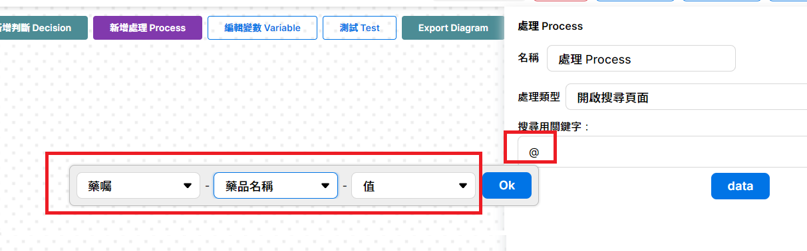

8. After finish above steps click the button "啟用" to active the rule.

   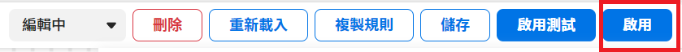

9. Go back to Tutorial 5, click any patient's drug list. Enter `bokey`(`drugCode BOK01O`) to search. After you click the search result, there will open a web with Google Search result and the keyword is the name of this drug.
10. The sample code for "開啟搜尋頁面" is in `src/tutorials/tutorial_5/widgets/drugList/drugList.vue:L431`. `OpenSearch` is the value of `resolverKey` and  `resultData.result.keyword` is what you had configured in rule "藥囑-藥品名稱-值"

    <<< @/../src/tutorials/tutorial_5/widgets/drugList/drugList.vue#OpenSearch{ts}

11. If you are interesting in custom action, see [Introduction for Custon Actions](https://github.com/ASUS-AICS/xhis-rule-schema/tree/master/src/actions) for more information.

## What you have learned

1. How to trigger rules with specific `TriggerType`.
2. How to handle action in the rule executions results.
3. How to use Custom Action.

## Assignment

1. Add a custom action "SearchICD" and add a rule with this action.
2. Handle this action on ICD widget when there is **a new ICD code with A as its first letter**, open a Google Search result with keyword `診斷碼-編碼`.

## Reference

1. [Rule Service Architecture](https://asus.sharepoint.com/:w:/s/HIS/ET4l-nqvOIFCv2sX4VxsBx0B3hPcwZBfgKa5eOE7m5GfBA?e=bCd1NC)
2. [Rule Configurator Operation Manual](https://aicswiki.azurewebsites.net/en/project/saas-his/xHis/rule-configurator-operation-manual)
3. [Introduction for Custon Actions](https://github.com/ASUS-AICS/xhis-rule-schema/tree/master/src/actions)
4. [API Docs for Rule Service](https://aicswiki.azurewebsites.net/en/project/saas-his/xHis/Guideline/new-page)
5. Rule Related SDK
