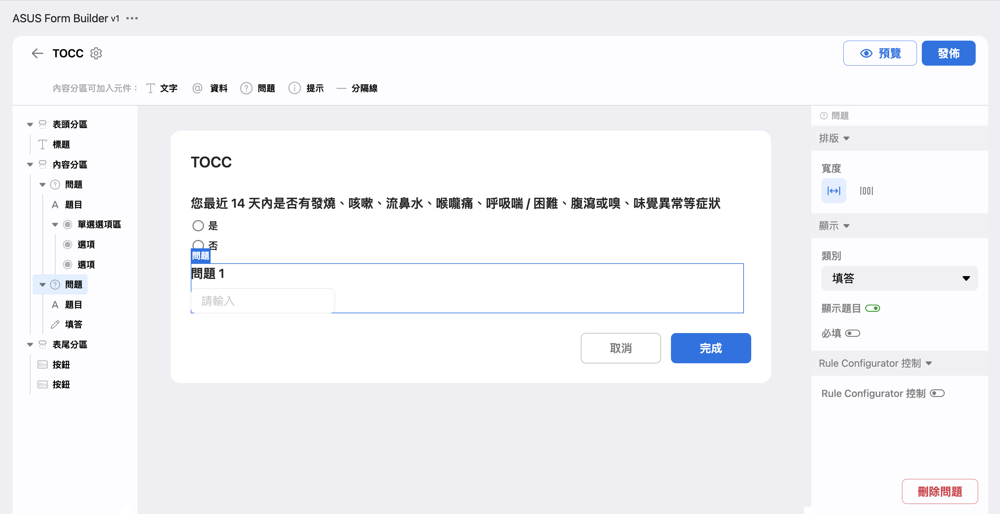
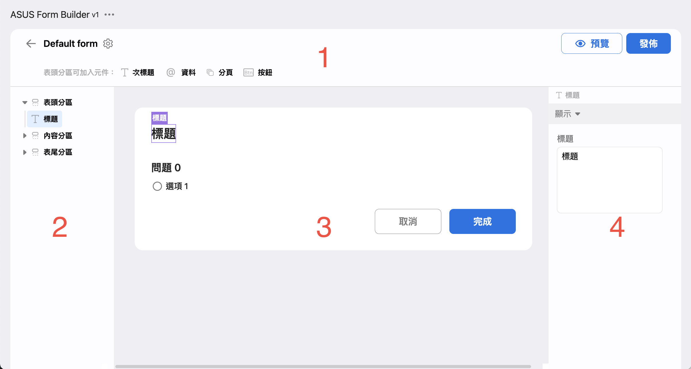
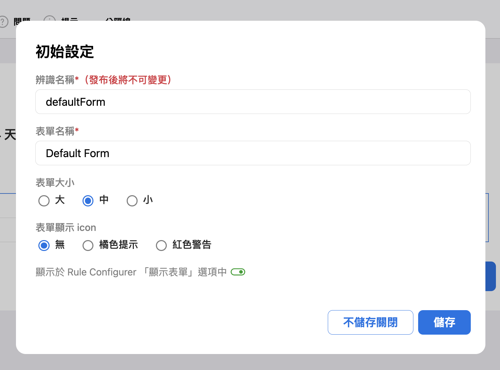
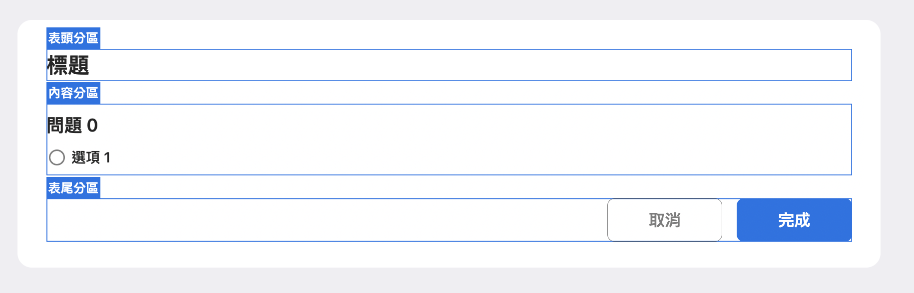
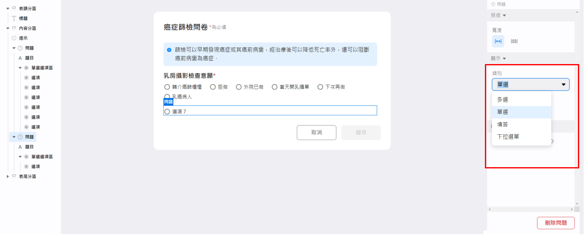
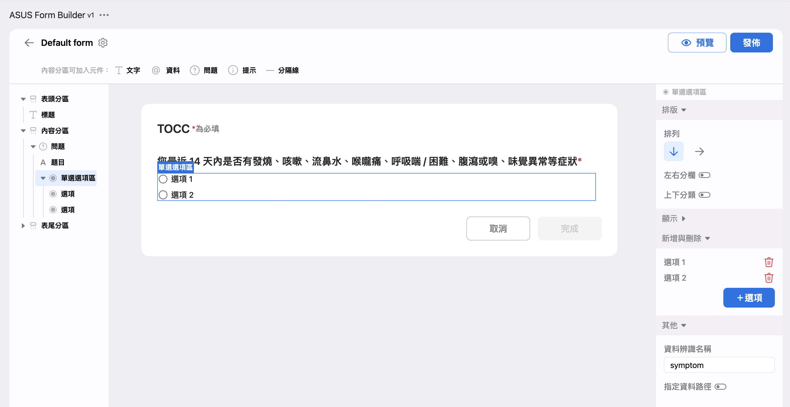
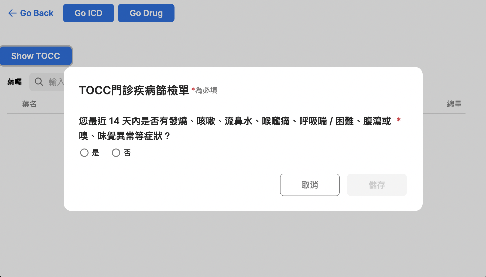
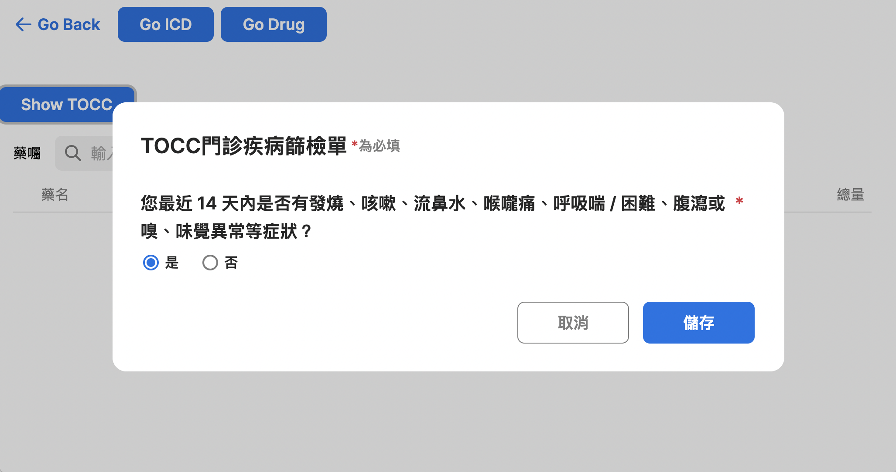
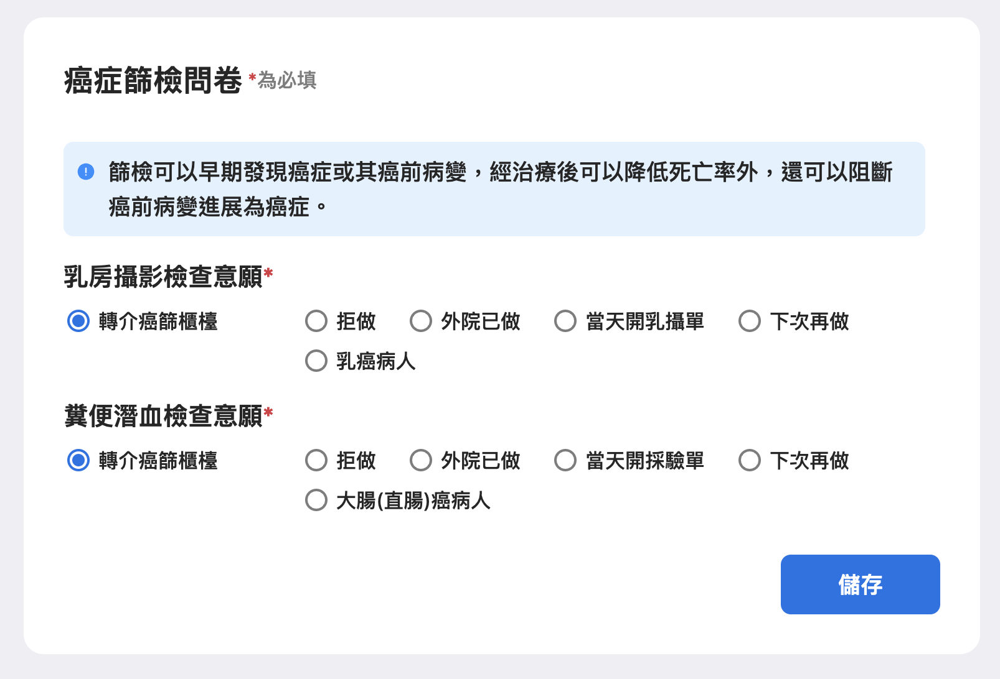

# Form Builder

## Goal

Understand how to build a form, display it in a widget or by the rule engine. Then let user fill the form and save, and display filled response in the form finally. One will also understand how to display customized content for each patient.

## Material

Basic Form Builder Usage: [Manual](https://asus.sharepoint.com/:p:/r/sites/AICS470/_layouts/15/Doc.aspx?sourcedoc=%7B2EAFFEF8-A14B-4940-A498-2667CC5992E4%7D&file=Form%20Builder%20%E4%BD%BF%E7%94%A8%E6%89%8B%E5%86%8A.pptx&action=edit&mobileredirect=true)

### Basic Form Builder Usage: Build a simple form on form builder

We'll show you how to create a TOCC form easily step by step in this section. Here's what we will create after the end of this section:

> 💡 Before go through this tutorial, please update the variable `VITE_TUTORIAL_INDEX=6` in `.env.local`.



1. Open [online form builder](https://xhis-playground-dev.southeastasia.cloudapp.azure.com/web/formv1), and click '＋新表單' button to edit a new form
2. There are 4 parts in the form builder:

   

   - The tool bar. You could set the form setting (the gear icon in the up right), add new components like questions, and preview / save the form.
   - The navigator. The form consisted of nested components. You could expand the tree node by clicking the triangle arrow, and select a component by clicking its name.
   - The previewer. You could preview how the form looks like, and select a component by directly clicking on it. The selected will be highlighted. If you felt it's hard to selected the component you wish, you could select it in the navigator instead.
   - The configure editor. You could set attributes of the selecting component here. The change is applied instantly.

3. Click the form setting in the toolbar (the gear icon in the up right). The changes will be applied after save.

   

   - `辨識名稱` is the identifier to the form, we will display the form using this identifier in the later steps.
   - `表單名稱` is the name of the form for human to read.
   - `表單索引` means how we find existing data and replace it when needed while save a new response. If one select `病患`, then we will have save one response for each patient, new response will replace the old one. If one select `門診藥品`, then we save one response for each drug in the encounter.
   - `顯示於` Rule Configurator `「顯示表單」選項中` determines whether the form is listed in rule configurator or not. No matter on or off, we could always display the form in a widget.

4. Here is some detailed constraint and recommendation when you set `辨識名稱` Consisted of alphabet, number, dash (-), and underscore (_). Must start with an alphabet. (Recommend) Name it in the style `<Category>-<Name>`, with existing category like rule, form, order, and the name could easily understand the functionality of the form, in lower camel case (ref to [wiki](https://en.wikipedia.org/wiki/Camel_case)). Example: `rule-doseAduit`.
5. We set `辨識名稱` to playground-TOCC, and click `儲存` to save and close the dialog.
6. A form existing three different section: `表頭分區`, `內容分區`, and `表尾分區`. Each section comes different usage: `表頭分區` contains title of the form, `內容分區` contains all questions of the form, `表尾分區` contains buttons to save the result or just cancel and leave.

   

7. Click on title in the *previewer* to select it, you could edit the form title in the configure editor. Change it to the desired title.
8. Click on the `問題 0` in the *previewer*, or `題目` in the navigator. You could set `標題` of the question. Set it to be '您最近 14 天內是否有發燒、咳嗽、流鼻水、喉嚨痛、呼吸喘 / 困難、腹瀉或嗅、味覺異常等症狀'
9. Click on the `問題 0` in the previewer, or `問題` in the navigator. You could set some attributes like `類別` or `必填` in the configure editor.

  

10. Let's turn on `必填`. The `完成` button in the `表尾分區` should be disabled immediately, means that the form is not completed. You might noticed a * mark is attached after the question, means the question is required.
11. Select `單選選項區` in the navigator (if you cannot find it, toggle on the triangle arrows), you could add options in configure editor by clicking on `＋選項`. Try to add one new option.
12. In the `單項選項區`, Let‘s edit the `資料辨識名稱`. `資料辨識名稱` represents how we store the response. One could treat the response as an JSON object, and `資料辨識名稱` is the key to response of this question. For example, if you set it to symptom, the response should be `{"symptom": "someChoice"}`. There's also constraints on it like `辨識名稱` in settings, since it's tightly related to how we store and access data. Consisted of alphabet, number, and underscore (`_`) (Without dash!). Must start with a alphabet.
13. After These steps, you should get a form like the following image:

    

14. Click options in previewer. You could edit `選項名稱` and `資料回傳值` in the configure editor. Set `選項名稱` to `是`, `否` respectively for two options, and also change `資料回傳值` as `true` and `false`.
15. Now we finished editing a question. To add more questions, click `問題` in the tool bar (after `內容分區可加入元件`).
16. Click `預覽` button in the tool bar. Now you could select options or input text to the questions.
17. Click `發布`, then the form will be saved. You will able to find your form in the form list in the [form builder](https://xhis-playground-dev.southeastasia.cloudapp.azure.com/web/formv1/).

### Basic Form Builder Usage: Modify widget to show the form

1. Run `npm run dev` in terminal
2. Open browser with the link: <http://localhost:5173>. You will see a Tutorial selecting page and please select Tutorial 6.
3. You could find an example widget demonstrating how to show the form.
4. A tutorial-TOCC form is built already.
5. `FormDialog` (`src/tutorials/tutorial_6/FormDialog.vue`) vue component is prepared in advance and mounted in 'drug' page (`src/tutorials/tutorial_6/Drug.vue`), to provide ability of displaying a form.
6. We uses the `useForm` (`src/tutorials/tutorial_6/composable/useForm.ts`) composable to display any form. This composable is quite simple: send an event via emitter to invoke `onShowForm` in `FormDialog`.
7. Notice that the `useForm` composable shall be provided in library in future, and the environment rendering a form (including `FormDialog` component) is already setup and mounted in the platform.
8. In the `src/tutorials/tutorial_6/widgets/drugList/ToccForm.vue`, we built a button, which will trigger function to show the tutorial-TOCC form after one clicks it.
9. Now goto 'drug' page of any patient, you could notice that there's a `Show TOCC` button. Click it, then the TOCC form should pop up.

   

10. In the steps above, the environment for popup a form already built within the tutorial. And it will be also build within the platform. Here's how the environment is setup:

    1. Form requires the `windicss` package (Official site: [windicss.org](https://windicss.org/)) to provide correct css. The windicss config file (`windicss.config.ts`) is set to be providing styles for `@asus-aics/xhis-form-builder-v1` package.
    2. Register windicss plugin (The `WindiCss()` object) in `vite.config.ts`.
    3. Importing css styles. We import `virtual:windi.css` and `@asus-aics/xhis-form-builder-v1/style.css` in `src/main.ts`.
    4. Mount the `FormDialog` component in `src/tutorials/tutorial_6/Drug.vue`. Once the component is mounted, it start listening events from the `useForm` composable.
    5. As a result, anyone could show a form via `useForm` composable in step 6.

### Basic Form Builder Usage: Display Form with Filled Data from Database

1. In the widget, click the `Show TOCC` button, and fill any data and click `儲存` button.
2. Notice that the `loadMode` is Valid (in `src/tutorials/tutorial_6/widgets/drugList/ToccForm.vue`). This means the form will try to load existing data if possible.
3. Click the `Show TOCC` button again, you will see just filled result.



### Basic Form Builder Usage: Get Result from component or API

1. One could access response directly from component. Open devtools by F12, then open and the fill the form again.
2. You will notice that console logged form result: …
3. The log is sent from `ToccForm.vue` file. One could use return value from `fillform` function directly.
4. (Advanced) (TBD) We could also access the filled response directly via API.
5. The following example uses `curl`, you must specify authorization in header, `formId` and `indexes` in query. `formId` should match which we set to `識別名稱`, `indexes`

   ```sh
   curl --header "authorization: TOKEN" 'https://xhis-playground-dev.southeastasia.cloudapp.azure.com/api/form/form-response?formId=testForm1&indexes[]=patientId-A1234' 
   ```

   You will receive latest response for patient like:

   ```json
   {
    "formId": "testForm1",
    "indexes": [ "_patientId-A1234" ],
    "items": [
      {
      "name": "field1",
      "value": "value1"
      },
      {
      "name": "field2",
      "value": "some free text"
      },
    ],
    // …
   }
   ```

6. We go deeply about what is respond:

   ```ts
   {
    formId: string,
    formRawId?: ObjectId, // form with variation

    formVersion: {
      major: number // breaking data schema

      minor: number // extended data schema 

      patch: number // UI change only 
    },
    indexes: string[],
    active: string, // active, delete, archived
    complete: string, // unchecked, completed, inProgress, amended
    completeTime Date,
    expireTime: Date,
    practitionerId: string,
    patientId?: string,
    items: [
      {
        name: string, // example: 'symptom'
        value: any,  // example: 'HTN'
        display?: string,  // example: '症狀：高血壓'
      },
    ],
    accessRules: [
      // ...
    ],
   }
   ```

### Interact with rule engine: Built a Rule to Show Different Content for form

1. There an existing example rule: open [this rule](https://xhis-playground-dev.southeastasia.cloudapp.azure.com/web/rule/rule-editor?serialNo=230105001&timestamp=1672892009933&isText=false)
2. It says: while you prescribe 'FOR01I' drug, show the form to do some checks. The options might be disabled base on patient's gender.
3. It should open [this form](https://xhis-playground-dev.southeastasia.cloudapp.azure.com/web/formv1/builder?name=drugAudit-Teriparatide&version=3)

### Interact with rule engine: Trigger the Rule to Show the Form

1. Test the rule out. Open Tutorial 6, and select drug page of any patient.
2. We've add a new rule handler to show the form in `src/tutorials/tutorial_6/widgets/drugList/drugList.vue`. You could find a line with handler `['ShowForm'] =` , which uses `useForm` again.
3. Open Tutorial 6, and open drug page of any patient.
4. Find and add a drug: **Forteo Inj 28d/2.4ml#**. It's exactly the **FOR01I** drug. The form will pop up.

## What You Have Learned

- Basic Form Builder Usage
  - How to build a simple form on form builder
  - How to modify widget to show the form
  - How to display form with filled data from database
  - How to get result from component or API
- Interact with rule engine
  - How to built a rule to show different content for form
  - How to trigger the rule and show the form

## Assignment

- Create a 癌症篩檢意願調查單 form

  - Set the `資料辨識名稱` of two questions to `mammo`, `rectum` respectively
  - Set the `值` of each option to

  | Label | Value |
  |-------|-------|
  | 轉介癌篩櫃檯 | referral  |
  | 拒做 | refuse  |
  | 外院已做 | doneExternal  |
  | 當天開乳攝單 | inProgress  |
  | 當天開採驗單 | inProgress  |
  | 下次再做 | defer |
  | 乳癌病人 | diagnosed |
  | 大腸(直腸)癌病人 | diagnosed |

- Create a new widget <XButton>顯示癌症篩檢意願調查單</XButton> to pop up the form directly
  - Open the form, fill, save the result
- Create a rule that shows the form
  - When patient ID equals `TAI-017` or `TAI-019`, and prescribing any drug, display the form.
  - Show the customized content based on patient's gender, when it's male, hide the `乳房攝影檢查意願` question.
- Modify tutorial 6 and the rule to make it trigger the rule when on open patient ICD page instead of prescribing drugs.

<script setup>
import {XButton} from '@asus-aics/xui';
</script>
