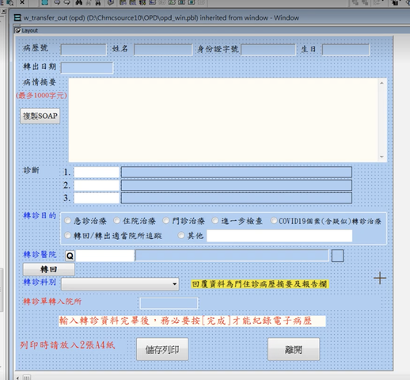

# Final Project

## Goal

Complete the xHIS Referral Form (as following figure) with the knowledge of xUI Component, Rule Engine and Form Builder learned from Tutorial 1 to 6.

## Preparation

### xUI Component to be used

- `xButton`
- `xAutocomplete`
- `xSelect`
- `xRadio`
- `xDialogue`
