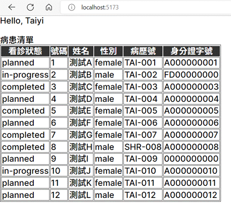
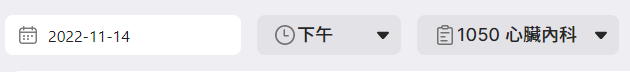
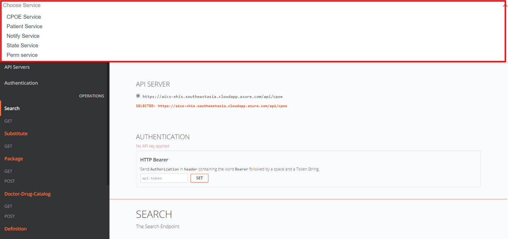
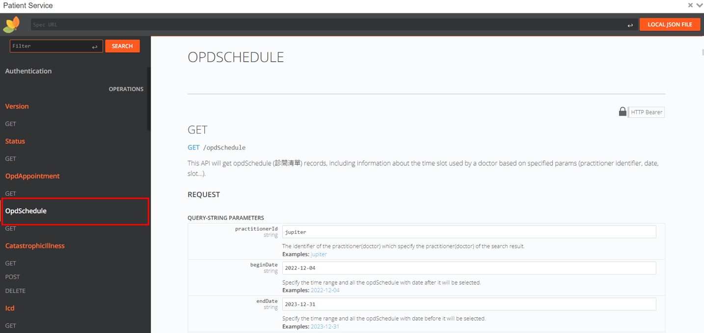

# 環境設置

## 目標

瞭解如何設定好開發環境以及成功執行基本的 "Hello World" 程式。

## 前言

開發 xHIS widgets 時會高度依賴於我們的 xHIS 後端服務，因此，我們提供了一個測試伺服器來模擬 API 的回傳結果，提供在本地測試其 widgets 的開發人員使用。開發人員必須取得 token 才能使用我們的測試伺服器。

## 內容

**Step 1**: 申請開發者的 token (<jim1_lin@asus.com>)

**Step 2**: 下載教學程式碼

```sh
git clone https://github.com/ASUS-AICS/xhis-frontend-sample.git
```

**Step 3**: 初始化環境

```sh
npm i
```

> 💡 上述的指令會下載需要的 npm packages 以及創建一個 `.env.local` 的檔案在該資料夾根目錄下

在 `.env.local` 的檔案裡，有兩個變數：

- `VITE_WIDGET_SDK_BACKEND_URL` 為我們測試伺服器的 URL。
- `VITE_WIDGET_SDK_DEV_TOKEN` 為開發人員的 token，默認為空值（具體配置請看後續步驟）。
- `UPLOAD_WIDGET_API_KEY`為上傳 Widgets 的 token，給予使用者上傳 Widgets 到Layout editor的權限，在`Widget and Layout`的課程中會使用到。

**Step 4**: 配置開發人員的 token

將開發人員的 token（您從第 1 步獲得的）複製並貼到 `.env.local` 檔案中。並放入 `VITE_WIDGET_SDK_DEV_TOKEN=` 之後，以及 Upload widget 的 Token 並放入 `UPLOAD_WIDGET_API_KEY=` 之後。

**Step 5**: 啟動 local server

```sh
npm run dev
```

**Step 6**: 打開瀏覽器並在網址列輸入：<http://localhost:5173/>。您將看到一系列的教學列表頁面，請選擇教學1。

> 💡 請注意，您必須瀏覽 <http://localhost:5173/> 而不是 <http://127.0.0.1:5173/> ，否則在進行 API 請求時會遇到 CORS 錯誤。

您將看到如下結果，其中 "Taiyi" 是您的開發者用戶名，患者列表是從我們的測試伺服器獲取的測試資料。



**Step 7**: 程式碼範例

請打開 `src/tutorials/tutorial_1/HelloWorld.vue` 查看教學1的範例。

<<< @/../src/tutorials/tutorial_1/HelloWorld.vue

## 學到了什麼

- NodeJS 和 npm 的環境建置
- 從 Widget SDK 教學中瞭解最基礎的檔案結構
- 如何向後端發送 API 請求

## 作業

1. 跟著本章節的內容以及設定好開發環境
2. 創建一個簡單的表單，使**日期**、**時間**和**科別**可以自由切換。您現在可以考慮使用 [`<input type="date"/>`](https://developer.mozilla.org/en-US/docs/Web/HTML/Element/input/date) 和 [`<select/>`](https://developer.mozilla.org/en-US/docs/Web/HTML/Element/select) 等 HTML 原生元素來創建此表單，並使用 [`v-model`](https://vuejs.org/guide/components/v-model.html) 指令來雙向綁定值。
   
3. 試著通過以下程式碼範例使用 **opdSchedule** API 來獲取 opd schedule（診間清單）記錄。當 `encounterDate`、`slot` 或 `subjectId` 改變時呼叫 **opdAppointment** 來取得新的病患清單。

### **opdSchedule** 的 API spec

- Api: [GET `admin/opdSchedule`](https://xhis-docs.azurewebsites.net/main#tag--opdSchedule)

> 💡 請注意，您在瀏覽API連結時，網址會自動跳轉回 <https://xhis-docs.azurewebsites.net/main#tag--search> ，此為正常現象

- 請在網站上方的Choose Service選擇 **Patient Service**
- 在左邊的選單中即可看到 **opd schedule**，以及其他會在此次課程中使用到的API



  
[GET] `CONSTANTS.SERVICES.OPD_SCHEDULE` 呼叫變數:

- `practitionerId`: 醫生的ID
- `beginDate`: e.g. '2022-12-05'
- `endDate`: e.g. '2023-03-06'

Example response body:

```json{2-5}
[{
  "date": "2022-10-04T16:00:00.000Z",
  "slot": "morning",
  "subjectId": 10000,
  "subjectName": "疑難雜症科",
  "practitionerId": "jupiter",
  "practitionerName": "JUPITER",
  "roomId": 1,
  "active": "normal",
  "appointmentCount": {
    "count": 12,
    "isVisited": false
  }
}]
```

這些是您可能需要用到的 Vue Composition API：

- [`ref()`](https://vuejs.org/api/reactivity-core.html#ref)
- [`watch()`](https://vuejs.org/api/reactivity-core.html#watchposteffect)

您可以使用以下的常數來為 **time slot** 創建選擇菜單：

```js
const slotLabelMap = {
  morning: '上午',
  afternoon: '下午',
  evening: '夜間',
};
```
