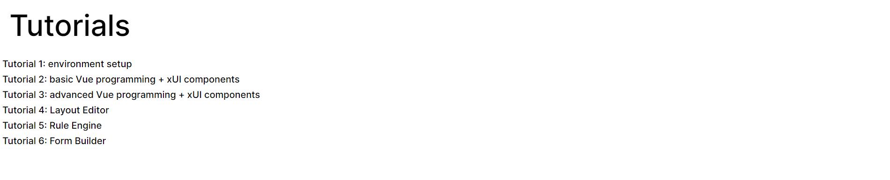
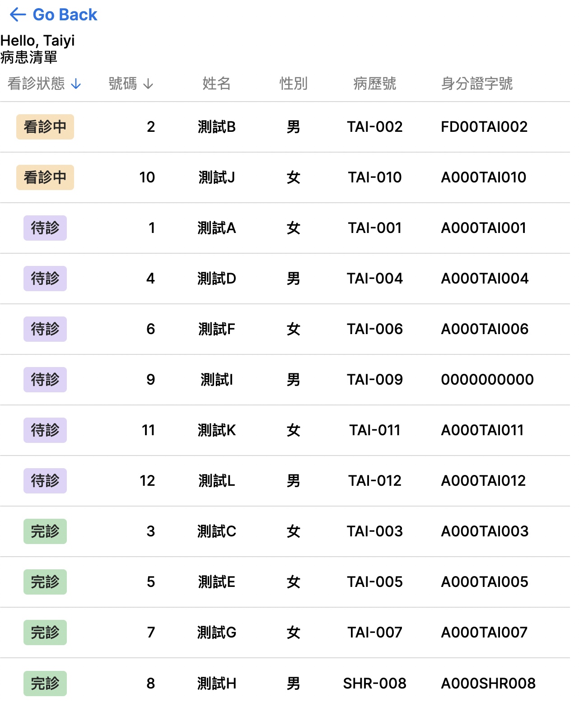
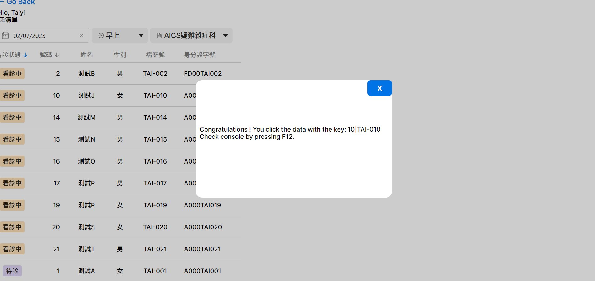

# 基本 xUI 元件

## 目標

瞭解如何透過xUI來加速widget開發流程

## 內容

**步驟一**: 確認xUI展示與文件: [xHIS UI - xHIS (azure.com)](https://aics-xhis.southeastasia.cloudapp.azure.com/web/xui/)

**步驟二**: 在終端機中執行 `npm run dev`

**步驟三**: 打開瀏覽器連結: `http://localhost:5173/`。你將看到一個教學選擇頁面，請選擇教學2



你將看到如下圖所示的結果，在本教學中，使用我們開發的`XTable`代替原始的HTML表格。我們的 `XTable` 不僅提供了更漂亮的UI，還提供了一些基本功能，例如按某些列進行排序。



此教學將實作病患清單與看診狀態，分別使用xUI實作在`src/tutorials/tutorial_2/PatientList.vue`與`src/tutorials/tutorial_2/PatientListCellState.vue` vue元件中

1. 首先可以查看XTable文件([link](https://aics-xhis.southeastasia.cloudapp.azure.com/web/xui/?tab=XTable))，介紹文件Props章節實作所需要的參數:
   - `data` prop是render表格資料所需要的資料
   - `options` prop是定義欄位設定
2. 透過api拿取病患清單資料:

   - 先在PatientList元件中定義render資料為`PatientList` vue ref，定義欄位資料為`tableColSchema`

   `patientList` vue ref:

   ```js
   const patientList = ref < any > [];
   ```

   `tableColSchema (src/tutorials/tutorial_2/utils/tableOptions.ts)`:

   <<< @/../src/tutorials/tutorial_2/utils/tableOptions.ts

   - 在`PatientList`元件中定義`onMounted` lifecycle hook中準備render資料

   `onMounted`:

   ```ts
   onMounted(async () => {
     try {
       // Get IAM information
       const me = (await api.userInformation()).data as any;
       userInfo.name = me.display_names[0]['name'];
       userInfo.id = me.idps[0]['user_id'];

       // TODOITEM: use opdSchedule to get room information
       const response = await api.serviceClient.get(CONSTANTS.SERVICES.OPD_APPOINTMENT, {
         params: RoomInfo.value,
       });
       patientList.value = response.data;
     } catch (e) {
       console.log('error: ', e);
     }
   });
   ```

   - 透過`api.userInformation()`拿到使用者姓名與ID資料.

   `api.userInformation()`:

   ```ts
   // Get IAM information
   const me = (await api.userInformation()).data as any;
   userInfo.name = me.display_names[0]['name'];
   userInfo.id = me.idps[0]['user_id'];
   ```

   - 透過`api.serviceClient.get()`拿到病患清單資料，並存回`patientList` vue ref

   `api.serviceClient.get()`:

   ```ts
   const response = await api.serviceClient.get(CONSTANTS.SERVICES.OPD_APPOINTMENT, {
     params: RoomInfo.value,
   });
   patientList.value = response.data;
   ```

   - `OPD_APPOINTMENT`api所需query string參數
     - `practitionerId`為使用者ID
     - `slot`為診別時段
     - `encounterDate`為診別日期
     - `subjectId`為科別ID
   - 以下為`OPD_APPOINTMENT` api回傳資料中，所定義的欄位資料
     - `encounterStatus`為看診狀態
     - `seqNo`為號碼
     - `patientName`為姓名
     - `patientGender`為性別
     - `patientId`為病歷號
     - `patientPersonalId`為身分證字號

3. 透過`XTable` dynamic slot實作表格內容

   - 看診狀態欄位使用`#cell-encounterStatus`，將status prop傳入`PatientListCellState`元件內

   `#cell-encounterStatus`:

   ```vue
   <template #cell-encounterStatus="{ content }">
     <PatientListCellState :status="content"></PatientListCellState>
   </template>
   ```

   - 首先可以查看`XTag`文件([link](https://aics-xhis.southeastasia.cloudapp.azure.com/web/xui/?tab=XTag))，使用`theme` prop控制tag樣式
   - 定義看診狀態樣式與顯示文字
     - `completed`
       - 顯示文字為`完診`
       - 樣式為`green`
     - `planned`
       - 顯示文字為`待診`
       - 樣式為`violet`
     - `in-progress`
       - 顯示文字為`看診中`
       - 樣式為`orange`
     - `undefined`
       - 顯示文字為`--`
       - 樣式為`neutral`

   `PatientStates (src/tutorials/tutorial_2/PatientListCellState.vue)`:

   ```ts
   const PatientStates: Record<string, { name: string; theme: XColorTheme }> = {
     completed: {
       name: '完診',
       theme: 'green',
     },
     planned: {
       name: '待診',
       theme: 'violet',
     },
     'in-progress': {
       name: '看診中',
       theme: 'orange',
     },
     undefined: {
       name: '--',
       theme: 'neutral',
     },
   };
   ```

   - 轉換性別顯示文字
     - Male顯示文字為`男`
     - Female顯示文字為`女`
     - 非male與female顯示文字為`未知`

   `toGenderText (src/tutorials/tutorial_2/utils/patientUtils.ts)`:

   <<< @/../src/tutorials/tutorial_2/utils/patientUtils.ts

   - 看診狀態排序

     - 設定`default-sort-index`為`encounterStatus`

     `default-sort-index prop`:

     ```vue
     <XTable
       :data="patientList"
       :options="tableColSchema"
       :key-index="['seqNo', 'patientId']"
       default-sort-index="encounterStatus"
       interactive
       style="cursor: default"
       @row-click="handleRowClick"
     >
     </XTable>
     ```

     - 在tableColSchema的`encounterStatus`欄位設定sort function
     - 使用`generateSortFunctionFromSeq`設定排序優先級為`in-progress`、`planned`、`completed`

     `sort field (src/tutorials/tutorial_2/utils/tableOptions.ts)`:

     ```ts
     import { generateSortFunctionFromSeq } from '@asus-aics/xui';

     {
       index: 'encounterStatus',
       align: 'middle',
       title: '看診狀態',
       sort: generateSortFunctionFromSeq(['in-progress', 'planned', 'completed']),
       width: '100px',
       cellStyle: { padding: '0 8px' },
       headStyle: { padding: '0 8px' },
     }
     ```

## 你可以學到什麼

- 如何查找官方xUI文件
- 如何導入和使用xUI

## 作業

1. 按照內容並設置本地環境
2. 嘗試使用`XDialogue`在用戶單擊患者列表中的患者時顯示對話。
3. 嘗試使用 `XDateTimePicker`, `XSelect` 替換你在教學1中使用的元件




