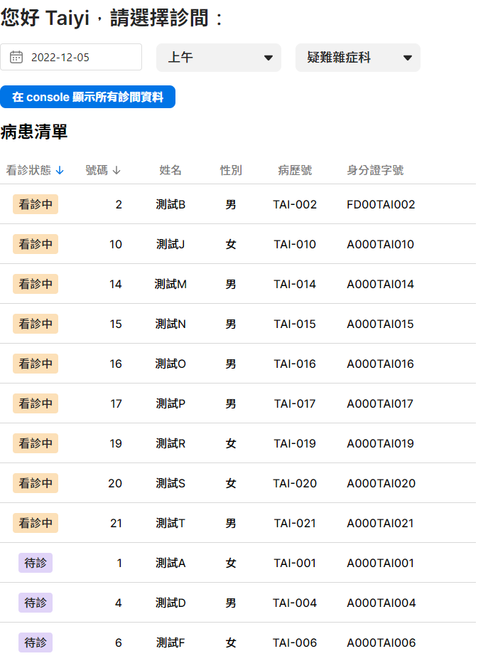
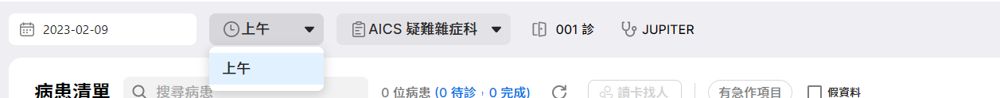
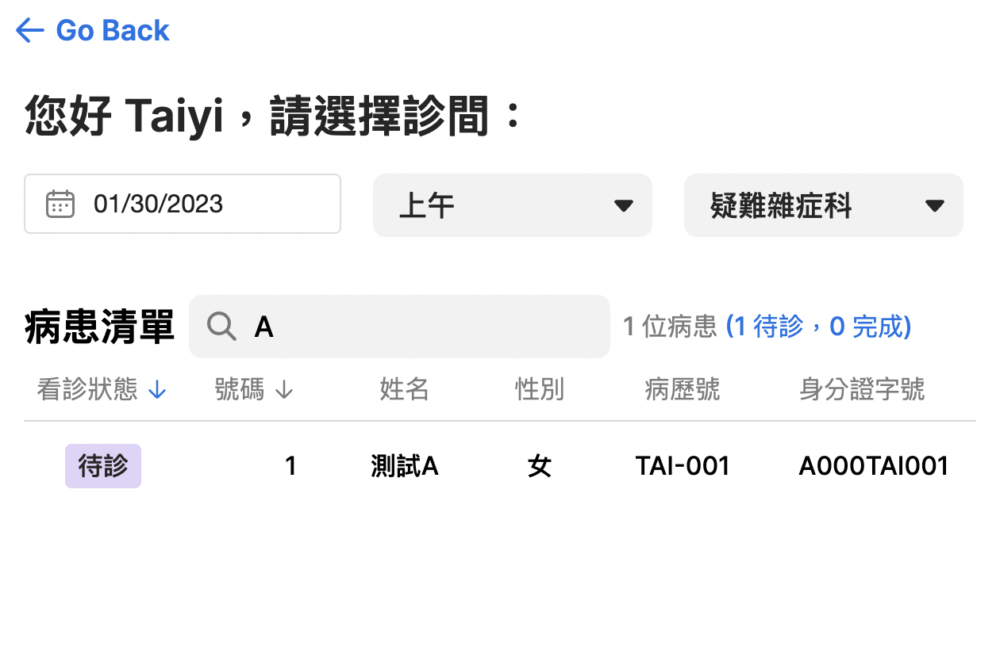

# 進階 xUI 元件

## 目標

本篇將了解進階的 Vue 及 xUI 概念.

我們會解構一個大型的元件成為數個組合式函數(composables)，並且實作 Vue3 的組合式 API 來建立資料與 UI 元件之間的響應.

## 內容

**步驟一**: 請詳閱下面的技術文件:

- xUI 展示及文件: [xHIS UI - xHIS (azure.com)](https://aics-xhis.southeastasia.cloudapp.azure.com/web/xui/)
- 組合式函數: [Composables | Vue.js (vuejs.org)](https://vuejs.org/guide/reusability/composables.html)

**步驟二**: 在指令視窗下執行 `npm run dev`

**步驟三**: 開啟連結: <http://localhost:5173>. 你會看到教學頁面，請選擇第三章教程.

你會看到如下圖所展示的畫面

::: info Figure.1
{width=50%}
:::

在這堂教學裡面，我們增加了下列的功能:

- \*\*AICS CSS 排版及顏色系統:

  - 在 `src/tutorials/tutorial_3/PatientList.vue` 裡面的 template 區段，我們使用預先定義好的 CSS 排版 [typography](https://aics-xhis.southeastasia.cloudapp.azure.com/web/xui/?tab=Typography), 例如你可以發現標題的部份，使用了預先定義好的樣式名稱 `xv-headline--headline-sm`.

    <<< @/../src/tutorials/tutorial_3/PatientList.vue#css1

  - 在 style 區段, 可以看到預先定義好的顏色變量 `var(--xv-text--high-emphasis-text)`。可以參考我們的 [顏色系統文件](https://aics-xhis.southeastasia.cloudapp.azure.com/web/xui/?tab=Color+System) 找到這些定義好的色彩。

    <<< @/../src/tutorials/tutorial_3/PatientList.vue#css2

- **Vue 組合式 API**:

  - 在這篇教學裡，我們增加了一個組件資料夾來處理基本的門診資料邏輯，請參考這個檔案: `src/tutorials/tutorial_3/composable/useOpdInfo.ts`。 這個 `useOpdInfo` 組件負責處理三種門診資料結構，詳細描述如下:

    - `UserInfo`: 基本的使用者(或醫生)資訊，包含了使用者姓名及使用者 ID。

      <<< @/../src/tutorials/tutorial_3/composable/useOpdInfo.ts#UserInfo
      <<< @/../src/tutorials/tutorial_3/composable/useOpdInfo.ts#userInfo

    - `RoomInfo`: 基本的診間資訊。診間資訊包含 `practitionerId` (即使用者 ID 或醫生 ID), `slot` (即時段，例如上午、下午), `encounterDate` (診間資料), and `subjectId` (科別 ID).

      <<< @/../src/tutorials/tutorial_3/composable/useOpdInfo.ts#RoomInfo
      <<< @/../src/tutorials/tutorial_3/composable/useOpdInfo.ts#roomInfo

    - `opdState`: 我們可以把 opdState 視為 `UserInfo` 和 `RoomInfo` 的交集組合. 事實上，上述的兩項資料結構 `UserInfo` 及 `RoomInfo` 都是由 `opdState` 即時生成的，並且保持響應更新 (利用 Vue [`computed`](https://vuejs.org/guide/essentials/computed.html#basic-example) 來做到這點)。所以 `userInfo.id` 與 `roomInfo.practitionerId` 這兩個 id 是相同的。因此，我們是將這兩個 id 存放在一個變量裡面 (即 `opdState.id`)，並且依需求可以去創建響應式結構 (即 `userInfo` and `roomInfo`)。

      <<< @/../src/tutorials/tutorial_3/composable/useOpdInfo.ts#opdState

  - 此外，`useOpdInfo` 還提供了一些修飾函數，例如`setSlot`、`setSubjectId`、`setDate`，做為公開的界面接口來更改 opdState 內容而不需揭露 `opdState` 本身的內部參數。
    <<< @/../src/tutorials/tutorial_3/composable/useOpdInfo.ts#useOpdInfo

- 基於教程二的其他重構:

  - 在此篇教程三裡，我們也將病患清單的處理邏輯從 `PatientList.vue` 分離至 `usePatientList.ts` 裡面(參見 `src/tutorials/tutorial_3/composable/usePatientList.ts`). 病患清單基於資間資訊 `roomInfo` 而來，所以我們也應該將它做為參數放進 `usePatientList` 裡面。每次只要 `roomInfo` 有更新，病患清單就會自動響應地更新，因為我們使用了 Vue 的["監聽器 watch"](https://vuejs.org/guide/essentials/watchers.html)來監聽 `roomInfo` 的變化.

    <<< @/../src/tutorials/tutorial_3/composable/usePatientList.ts#getPatientList

  - 最終，`PatientList.vue` 就可以專注於渲染 UI 並將詳細邏輯隱藏到單獨的組件中。

- **API**:

  - 我們可以使用 API 來取得線上的資料，請參考 `./src/utils/api.ts`，該檔案提供了一個 API 呼叫界面可做使用。請參考 API 文件來獲得更多細節 [xHIS API documentation](https://xhis-docs.azurewebsites.net/)
  - 我們使用到的 API 有：

    - PatientList:
      - Api: [GET `admin/opdAppointment`](https://xhis-docs.azurewebsites.net/main#tag--opdAppointment)
    - ScheduleList:
      - Api: [GET `admin/opdSchedule`](https://xhis-docs.azurewebsites.net/main#tag--opdSchedule)
    - UserInfo:

      - Api: GET `iam/api/v1/users/@me`
      - Headers:

        <<< @/../src/utils/api.ts#userInformationHeaders

      - Response:

        ```json
        {
          "data": {
            "display_names": [{ "name": "USER_NAME" }],
            "idps": [{ "user_id": "USER_ID" }]
          }
        }
        ```

- **xUI**:

  - 請深入學習 xUI 並了解 UI 元件與資料間的響應關係，例如 `XDateTimePicker` 及 `PatientList.vue` 裡的 `XSelect`。
  - `xTable`:

    - 請參考 [xHIS UI - XTable](https://aics-xhis.southeastasia.cloudapp.azure.com/web/xui/?tab=XTable)

      <<< @/../src/tutorials/tutorial_3/PatientList.vue#XTable

    - data: 使用 `patientList` 做為主要的資料來源。
    - options: 使用位於 `src/tutorials/tutorial_3/utils/tableOptions.ts` 裡面的 `tableColSchema` 代入做為設定資訊。`index` 這個欄位內容對應資料來源 `patientList` 裡面的每個欄位. `patientList` 資料內容，可參考 API [GET `admin/opdAppointment`](https://xhis-docs.azurewebsites.net/main#tag--opdAppointment)。

      <<< @/../src/tutorials/tutorial_3/utils/tableOptions.ts#tableColSchema

## 學到了什麼

- 如何將一個大組件解構為多個組合式函數
- 如何利用 Vue 3 組合式 API 在資料和 UI 元件之間創建響應性更新

## 作業

1. 按照上面章節設置好你的本地開發環境
2. 您可能會注意到，在 `tutorial_3/composable folder` 中有一個 `useSchedule` 組件。請使用 API `opdSchedule` 取得實際有掛號病患的診間。 `XSelect` 的 `slots` 和 `subjects` 應該動態改變它們的選項，並且只顯示至少有一名掛號病患的診間。
   - 目前，這些選項是放在 `PatientList.vue` 中的一組靜態變量，你可以尋找 `slotOptions` 和 `subjectOptions`。
   - 你可以利用點擊按鈕 <XButton size="sm">在 console 顯示所有診斷間資料</XButton> 來檢查 API 的回傳值。你可以按 F12 打開控制台看到 API 回傳值。
   - 舉例來說，如果你透過`opd schedule api` 拿到的診間清單顯示在`2023/02/09`的`下午`和`晚上`的`AICS`疑難雜症科沒有任何病人，則使用者在slot的選項中就只能選擇`morning`作為選項。
    

3. 添加一個 `usePatientFilter` 組件，以利用某些病患屬性（例如，病患姓名或病患 ID）來完成搜尋病患的功能。

   ::: info Figure.2
   
   :::

<script setup>
  import { XButton } from "@asus-aics/xui"
</script>
