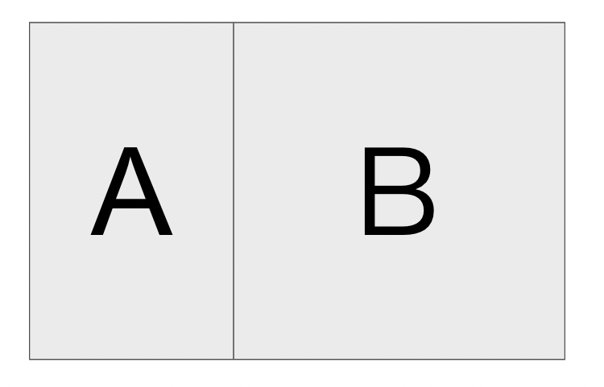
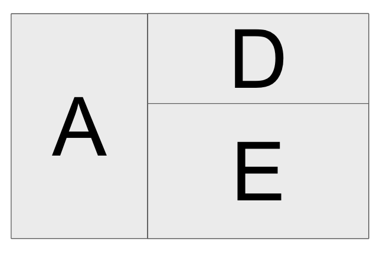
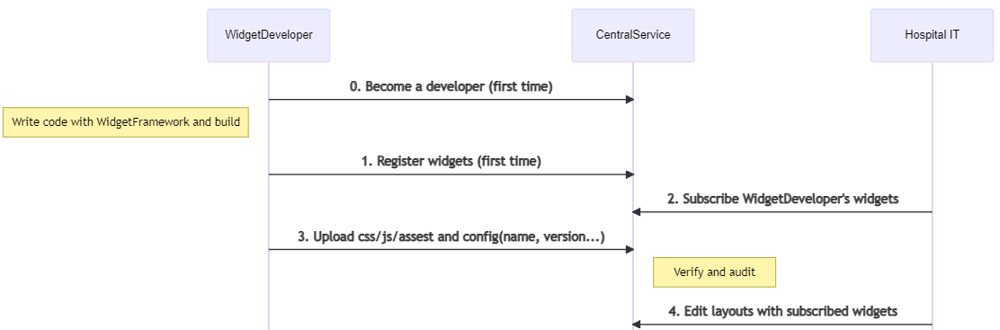
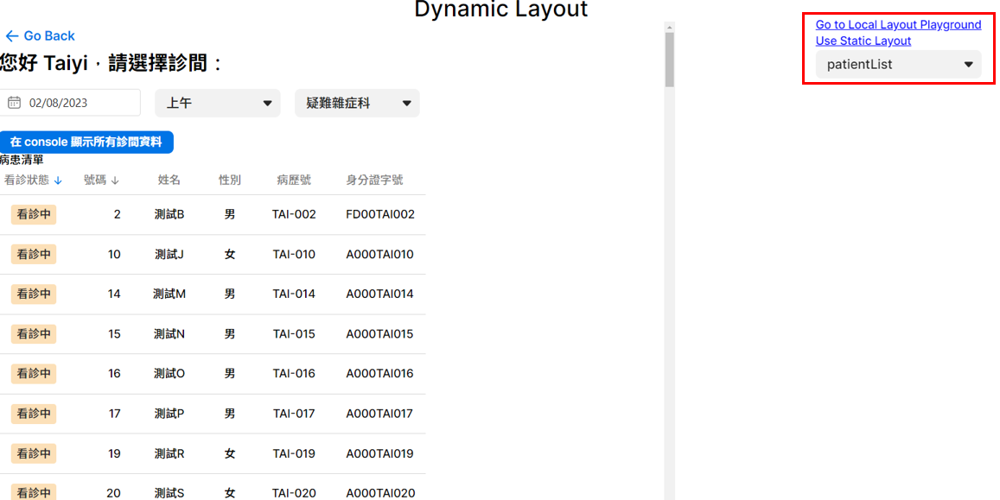
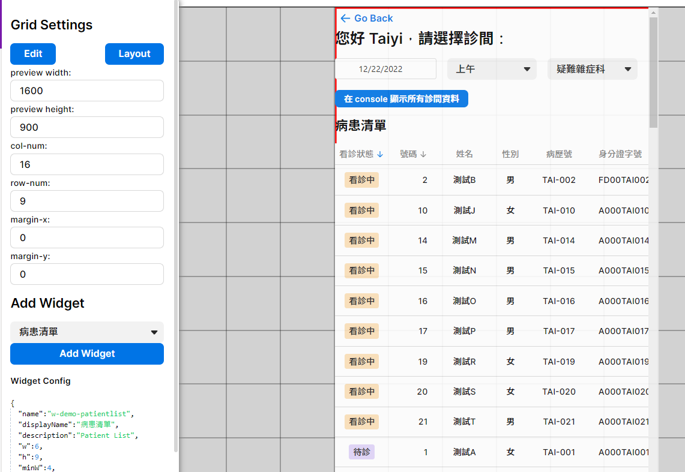
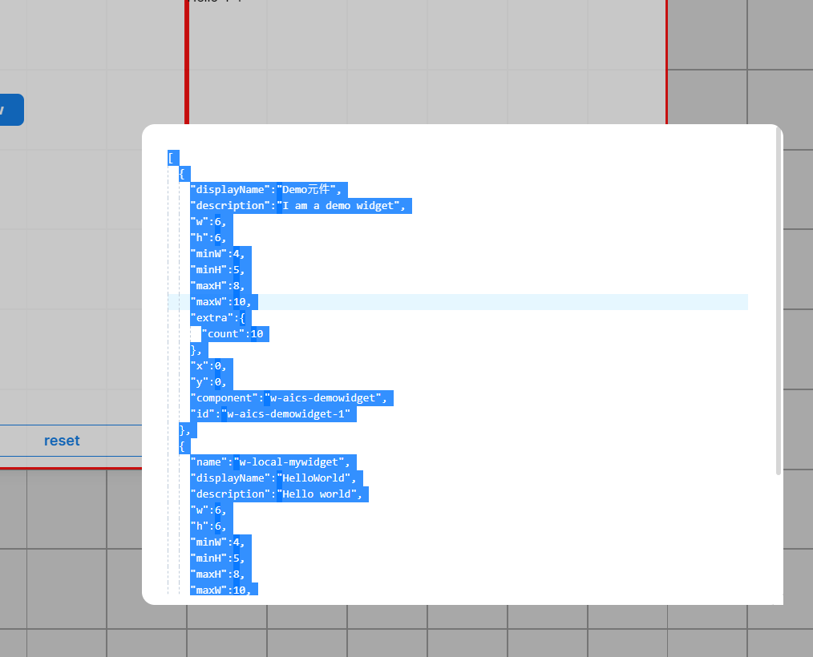
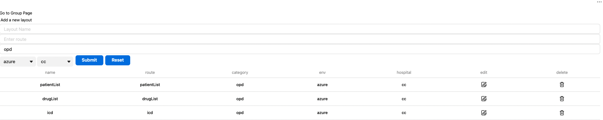
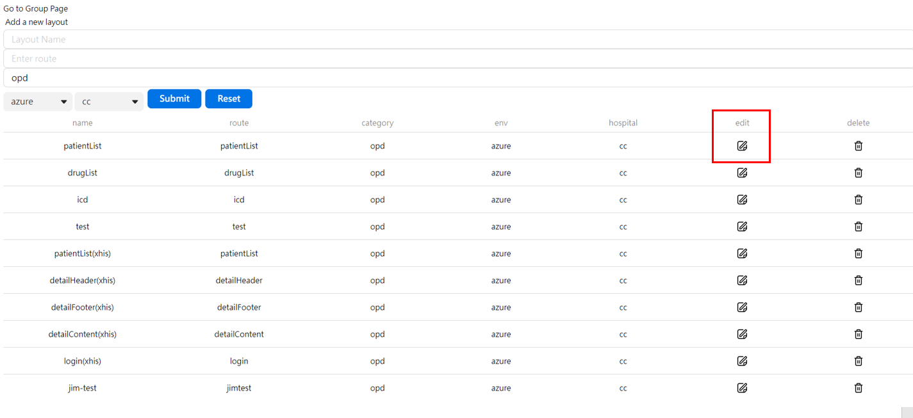
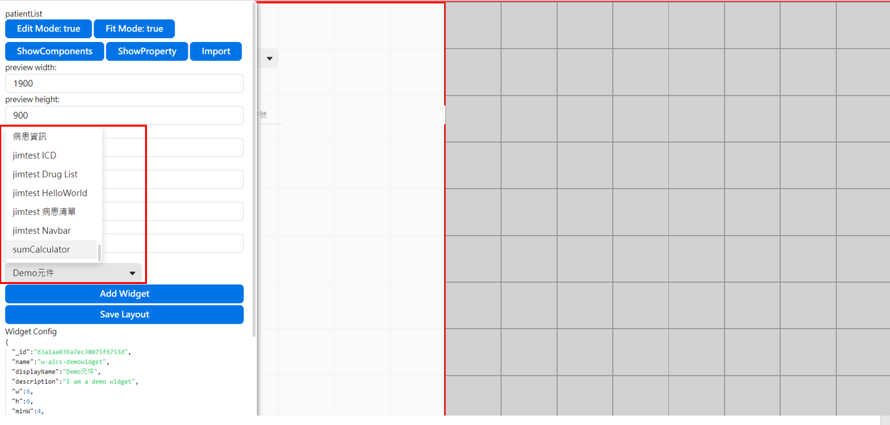

# Widget and Layout

## 目標

了解如何建立 Widget 與使用 Local Layout Playground 與 Static Layout。開發者在本機開發完 Widget，可以建置並發布所開發的 Widget。使用者使用更新過的 Widget 來編輯 Layout，並且可以在教學頁面上看到對應的改變.

## 名詞定義

在開始教學之前，我們先介紹一些專有名詞。

- Layout 由 至少 1 個以上的 Widget 組成。如下圖所示，`LayoutX` 由 `WidgetA` 與 `WidgetB` 組成，而 `LayoutY` 由 `widgetA`、`widgetD` 與 `widgetE` 組成。一個 Widget 可以被 0 或多個 Layout 使用，例如 `WidgetA` 被 `LayoutX` 與 `LayoutY` 使用。

  ||
  |:--:|
  |`LayoutX`|

  ||
  |:--:|
  |`LayoutY`|

- 開發者使用 Layout 來檢視或使用 Widget；醫院 IT 人員決定要在特定的 Layout 上使用哪些 Widget 以及如何組合這些 Widget。兩者關係如下圖所示：

  

## 內容

- Widget 的開發者需要知道如何建立 Widget，並且知道 Widget 如何在 Layout 上呈現。在這個教學裡，我們會介紹下列內容：
  1. 如何在本機開發 Widget
  2. 在 Layout Playground 檢視 Layout
  3. 使用 Static Layout
  4. 建置並發布所開發的 Widget
  5. 在 Layout Editor 更新 Layout
- 這個教學裡包含了 4 個主要元件：
  - **Local Layout Playground**: 在 Layout 上使用並調整本機的 Widget
  - **Static Layout**: 使用 Static Layout 來渲染頁面
  - **Dynamic Layout**: 使用 Layout Editor 提供的 Layout 進行互動
  - **Layout Editor**: 在 Online Layout Editor 調整並儲存發布的 Widget

:::info
在開始教學之前，請先在 `.env.local` 檔案裡設定：

```text
VITE_TUTORIAL_INDEX=4
```

:::

### 開發 Widget 並使用 Local Widget Playground

1. 開啟範例 [Tutorial 4](http://localhost:5173/tutorial-4) 頁面. 點擊右側的 「Go to Local Layout Playground」。根據預設設定，你會在可編輯的 Layout 上看到 `patientList` Widget。

   

2. 移動滑鼠游標到頁面左側，Layout 設定面板會由左側彈出，如下圖示意。

   

   以下圖為例，Layout 上的 Widget 寬度為 `600px`，高度為 `900px`。由於 Layout 預覽寬度為 `1600px`，`col-num` 為 `16`， 所以每個網格寬度為 `100px`。以此推論，Layout 上的 Widget 寬度為 6 個網格，高度為 9 個網格.

   

3. `w/h/minW/minH/maxW/maxH` 這些設定值的單位為「網格數量」（`grid number`）. 請開啟 `src/tutorials/tutorial_4/widgets/myWidget/config.ts` 查看註解以獲得更多資訊.
4. 你可以在 `src/tutorials/tutorial_4/widgets` 下創建自己的 widget，讓我們修改 `src/tutorials/tutorial_4/widgets/myWidget/myWidget.vue` 內 `myWidget` 的 `title` 為 `Hi World`. 重整頁面並將 `myWidget` 加入 Local Layout Playground，你會看到 `myWidget` 的 `title` 已經變更為 `Hi World`。

   <<< @/../src/tutorials/tutorial_4/widgets/myWidget/myWidget.vue#MyWidgetSetting{6 ts}

### 使用 Static Layout

1. 在使用 Static Layout 之前，隨意調整 Local Layout Playground 裡的 Layout 設定。點擊 `Layout` 按鈕，並複製 Layout 的設定。

   ||
   |:--:|
   |Layout Config|

2. 回到 Tutorial 4 並點擊 `Use Static Layout`。
3. 你可以看到已經有一個預設的 Layout。 要使用你自己設定的 Layout，用步驟 1 複製的 Layout 設定取代 `src/tutorials/tutorial_4/StaticLayout.vue` 裡的 `layoutComponents` 設定。

   <<< @/../src/tutorials/tutorial_4/StaticLayout.vue#StaticLayoutSetting{10-23 ts}

4. 重整頁面，你可以看到 Static Layout 已經變更成新的 Layout 設定。

### 建置並發布使用者開發的 Widget

到目前為止，我們已經可以在本機開發 Widget，並使用 Widget 建立並渲染 Layout。在接下來的教學裡，我們會建置並發布我們開發的 Widget，並在線上的 Layout Editor 編輯 Layout。

1. 執行下列指令來建置 Widget：

   ```sh
   npm run build-widgets
   ```

   如果建置過程出現錯誤，請確認 Widget 設定檔是否正確。

2. 如果建置過程沒有出現錯誤， 執行下列指令發布 Widget：

   ```sh
   npm run publish-widgets VERSION
   ```

   `VERSION` 為任意字串。

   - 如果在建置過程出現以下的錯誤
  
      ```sh
      ....a lot of messages above
         data: {
               name: 'NotAuthenticated',
               message: 'API Key is not matched',
               code: 401,
               className: 'not-authenticated',
               errors: {}
            }
         },
         isAxiosError: true,
         toJSON: [Function: toJSON]
      }
      ```

   - 請在 `.env.local` 中設置 `UPLOAD_WIDGET_API_KEY` (申請Token請聯絡<jim1_lin@asus.com>)

### 在 Layout Editor 上修改 Layout

1. 前往線上 [Layout Editor](https://xhis-playground-dev.southeastasia.cloudapp.azure.com/web/widget/), Layout Editor 已經有各種 Layout，包括 `patientList`、`icd` 與 `drugList`。

   

2. 點擊 `patientList` 的 `edit` 按鈕, 你可以任意調整 Layout 並儲存。
3. 回到 Tutorial 4 並重整頁面, 你可以看到剛才修改過的 Layout 出現在畫面上。

## 學到了什麼

- 了解如何使用 Widget SDK 開發 Widget。
- 能夠在本機渲染 Static Layout。
- 能夠建置並發布 Widget 到線上。
- 能夠在線上 Layout Editor 修改 Layout.
- 能夠使用線上 Layout Editor 設定的 Layout.

## 作業

1. 在 `src/tutorials/tutorial_4/widgets` 下新增任意 Widget。(請記得在新的Widget中添加`config.ts` 和 `index.ts` 檔案以正確創建 Widget)
2. 在 Static Layout 使用新建立的 。
3. 發布新建立的 Widget 並加入到既有的 Layout。
4. 發布成功之後，你可以在 layout editor 上選擇任意 layout 中的 edit 按鈕，之後將滑鼠移到畫面左側會出現設定面板，透過選擇`Add widget`內的選項，可以看到自己剛剛上傳的新 Widgets。



