# Rule Engine

## 目標

瞭解如何觸發特定的 `TriggerType` 的 Rule 以及如何處理這些 Actions。

## 前言

xHIS 是一個醫療平台，為了滿足各醫院的需求，xHIS 提供了 Rule Engine 來讓各醫院在該執行稽核的時間點能有各自的稽核邏輯以及對應的行為。進階的 Widget 開發者應該要掌握如何讓自己的 Widget 和 Rule Engine 搭配使用。

### 執行時機

如果你正在開發或將要開發的 Widget 的功能有包含到下列的時機點，你的 Widget 就需要執行 Rule 並處理對應的 Result。

- `ADD_DRUG`: 藥囑開立前檢查
- `ADD_ORDER`: 醫囑開立前檢查
- `ADD_ICD`: 診斷碼開立前檢查
- `EDIT_DRUG`: 已開立藥囑項目變更(含開立後加入)
- `EDIT_ORDER`: 已開立醫囑項目變更(含開立後加入)
- `EDIT_ICD`: 已開立 ICD 項目變更(含開立後加入)
- `LOGIN_OPD`: 系統登入
- `ID_FORM_INITIALIZE`: 身份設定初始化，當使用者在病患清單點擊一位病患且打開身份設定
- `ID_FORM_CHANGE`: 當身份設定的欄位有更新
- `ENCOUNTER_INITIALIZE`: 當使用者進入就診明細
- `TEMPORARY_SAVE`: 當使用者在就診明細點擊“暫存”
- `ENCOUNTER_DONE_CHANGE_VALUE`: 完成看診 - 資料變更
- `ENCOUNTER_DONE_BACK_TO_ENCOUNTER`: 完成看診 - 動作包含回到看診畫面
- `ENCOUNTER_DONE_NOTICE`: 完成看診 - 提示告知
- `ENCOUNTER_DONE_SPECIAL_CODE`: 當使用者在就診明細點擊「完成看診」
- `PACKAGE_DRUG_VALUE_CHANGED`: 套餐中的已開立藥囑項目變更
- `PACKAGE_ORDER_VALUE_CHANGED`: 套餐中的已開立醫囑項目變更

## 內容

關於如何使用 Rule Engine 最核心的部分有兩個，第一個是如何使用 SDK 執行 Rule，第二個是如何接收 Rule Engine 執行後的結果。 後續的步驟會介紹如何執行 Rule、如何處理 Result 以及自定義 Action

💡 在開始下面的 Tutorial 之前，為了讓 Tutorial 順利運作，請修改 `.env.local` 的變數 `VITE_TUTORIAL_INDEX=5`

### 如何使用 SDK 執行 Rule

1. 在 Tutorial 4 的時候，我們已經有了 `icdList` 和 `drugList` 的 widget，這兩個 widget 都需要搭配 Rule Engine 使用，所以我們在 Tutorial 5 的程式內新增了使用 Rule Engine 的程式，以下為幾個觸發不同時機的 Rule 的程式範例
   - 開立藥囑前：`src/tutorials/tutorial_5/widgets/drugList/drugList.vue:L456`

   <<< @/../src/tutorials/tutorial_5/widgets/drugList/drugList.vue#addDrug{ts}

   - 新增 ICD 前: `src/tutorials/tutorial_5/widgets/icd/utils/useIcdData.ts:L268`

   <<< @/../src/tutorials/tutorial_5/widgets/icd/utils/useIcdData.ts#addICD{ts}

### 如何處理 Rule 結果

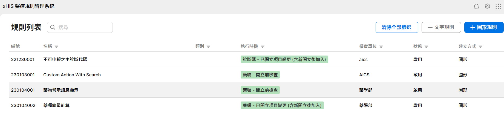

1. 在介紹如何處理 Rule 結果之前，我們先去 [Rule Configurator](https://xhis-playground-dev.southeastasia.cloudapp.azure.com/web/rule/) 看一下一個簡單的規則，登入後，點擊兩下「藥物警示訊息顯示」，你會看到這個 Rule 由一個 「Decision」 和一個 「Process」 組成，這個 Rule 的觸發時機是「藥囑-開立前檢查」。

   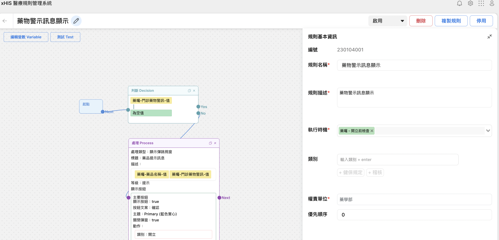

2. 這個 Rule 的意思是當現在將要開立的藥囑的「門診藥物警訊」有值（不為空值）的情況顯示彈跳視窗，這個彈跳視窗上面會顯示藥品名稱以及對應的藥物警訊，在這個彈窗可以有多個按鈕，在這個例子上有一個「確認」的按鈕來確認開立。
3. 現在我們回到 Tutorial 5, 我們嘗試去觸發一下這一條 Rule，這個 Rule 的觸發時機是「藥囑-開立前檢查」，所以我們挑選一個病人，並且進入 Drug 頁面。

   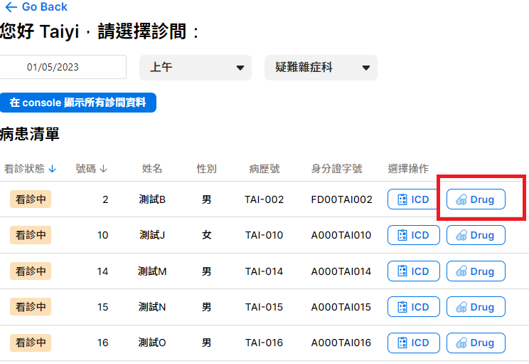

4. 我們需要開立一個有「門診藥物警訊」的藥，請在搜尋欄上輸入 `Chlorhexidine Liq (藍色) 2% 200ml Bot`，然後點擊這個藥品來加入藥囑清單。

   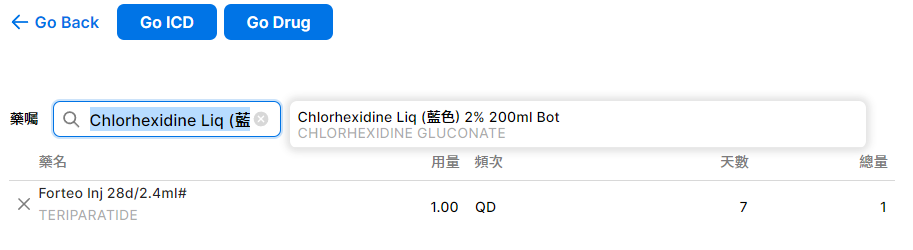

5. 當你點擊後過一下子後，你就會看到以下的彈跳視窗，這個彈跳視窗的內容格式就會跟剛剛看的那個 Rule 一樣。

   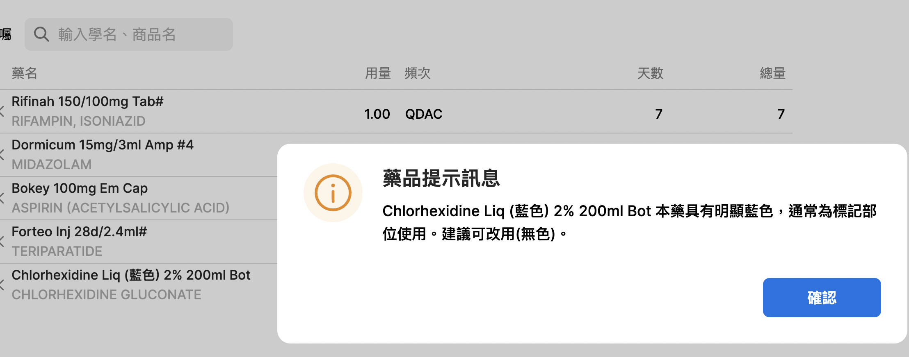

6. 上面這個例子，這個彈跳視窗是一次性的，不會殘留任何狀態。在一些情況下，我們需要把一些錯誤訊息留在畫面上，以及當條件不滿足後要把它清掉。以下我們透過一個 Rule 的例子來介紹 ICD 上的 Inline Error Message。
7. 點擊[連結](https://xhis-playground-dev.southeastasia.cloudapp.azure.com/web/rule/rule-editor?serialNo=221230001)去看另一個範例，這是一個 ICD 變更時要觸發的 Rule，這個 Rule 的意思是當主診斷的 ICD 限制代碼內有 Ｎ 的情況要顯示 Inline 文字訊息，說明這些診斷碼不可以是主診斷。

   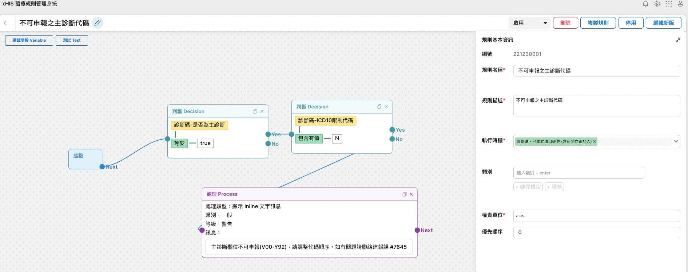

8. 我們再回到病患清單且點擊其中一位病患的 ICD，我們需要開立一個限制代碼有 Ｎ 的診斷，並且讓他當作主診斷（第一個）。首先請搜尋 `V00.01XA` 接著點擊後加入。

   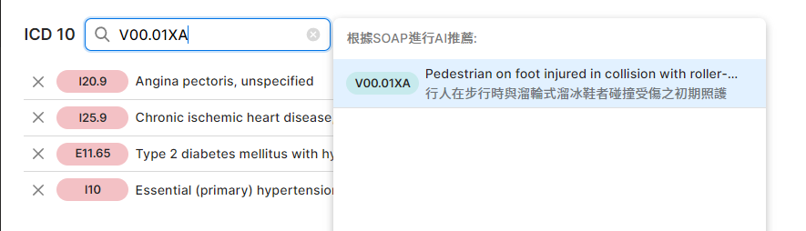

9. 接下來請拖拉以下圖片中紅框的位置到第一個，當你拖拉完後會看到紅色的 Inline 訊息。

   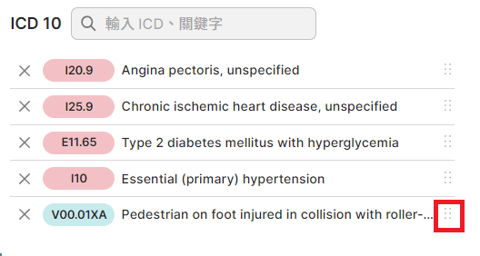

   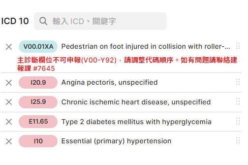

10. `icd` 的資料內有一個屬性叫 `errorList`，在這個例子就要將這個 Error 放到這個 `icd` 的`errorList`。如何處理的程式範例請看 `src/tutorials/tutorial_5/widgets/icd/utils/useIcdData.ts:169`：

    <<< @/../src/tutorials/tutorial_5/widgets/icd/utils/useIcdData.ts#ShowNotification

    - 可以從上面看到實際上，我們並沒有在`Rule Configurator` 上處理觸發規則之後應該在前端畫面上做什麼樣的應對，我們只是透過後端拿到對應的規則讓前端對相應邏輯進行處理，至於是在甚麼位置取得後端傳來的規則呢，在看下一段程式碼：
  
    <<< @/../src/tutorials/tutorial_5/widgets/icd/utils/useIcdData.ts#runAddIcdRules

    - 我們在此處透過`api.runRule`拿到後端處理過後的規則，接下來在一步步進行到`handler['showNotificaiton']`中，可以透過追蹤以上的程式碼，更了解Rule Engine是如何完成前後端的交互。

11. 上面的說明是要顯示的狀況，我們還需要搭配去處理當條件不滿足後，要把這個 Error 消除的情況。針對這個情況 Rule 有一個特別的 Action 稱為 `NoResult`，當這個 Action 出現時，需要針對他的 `rulePath` 去把對應的 Error 清除。以下程式範例(`src/tutorials/tutorial_5/widgets/icd/utils/useIcdData.ts:L144`) 就是如何將 `icd` 的 `errorList` 內的這個 Error 清除：

    <<< @/../src/tutorials/tutorial_5/widgets/icd/utils/useIcdData.ts#NoResult

12. 當這 ICD 移動到其他位置時，就會變成非主診斷，這 Inline Message 就會因此消失。

### 如何新增一個自定義的 Action

Rule Engine 只定義了一些常用且有限的 Action，這些 Action 將來可能會不夠滿足所有 Rule 的需求，所以我們提供了自定義 Action 的機制，讓開發者可以上傳他要的 Action，且在自己的 Widget 上處理這個 Action。我們假設現在有一個需求就是當一些特別的藥被開立的時候，需要顯示一些說明，因此我們新增一個自定義 Action，目標在 Widget 內開啟一個關鍵字是這個藥的名稱的 Google Search 網頁。

以下我們會介紹如何建立一條 Rule，這條 Rule 會使用到自定義的 Action 「開啟搜尋頁面」。

1. 我們再回到 [Rule Configurator](https://xhis-playground-dev.southeastasia.cloudapp.azure.com/web/rule/)，點擊 「＋圖形規則」 來新增一條 Rule。

   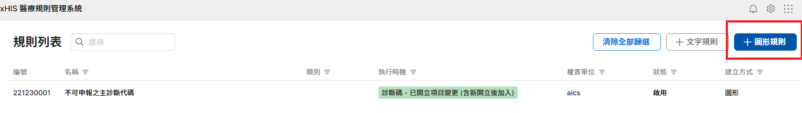

2. 按照圖片內容將資料填到規則基本訊息上。

   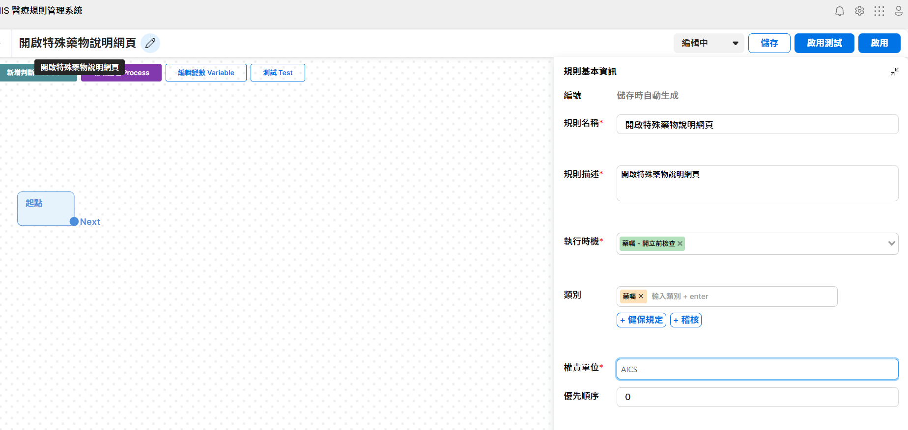

3. 點擊 「新增判斷」, 接下來會出先一個判斷的區塊，點擊這個區塊後可以在右邊進行設定。請依造截圖所示設定當藥囑代碼為 `["XYZ01O", "BOK01O"]` 其中之一的判斷。

   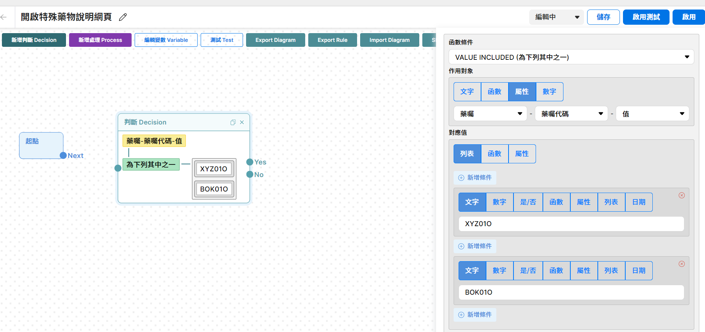

4. 設定好判斷後，接下來我們要設定 Action 的部分。不過在此之前，我們需要先將自定義的 Action 加進來。現在這功能還沒有正式的使用方式，但是我們這功能可以在特別模式下被使用。請先開啟瀏覽器的開發者模式，接著到 Console 的 Tab 下，輸入 `document.debugRuleEditor()`，接著請按「Import Action Config」後你會看到一個視窗：

   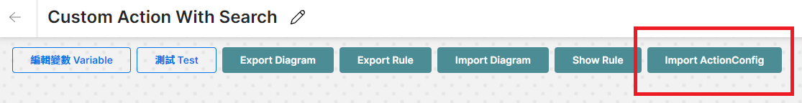

   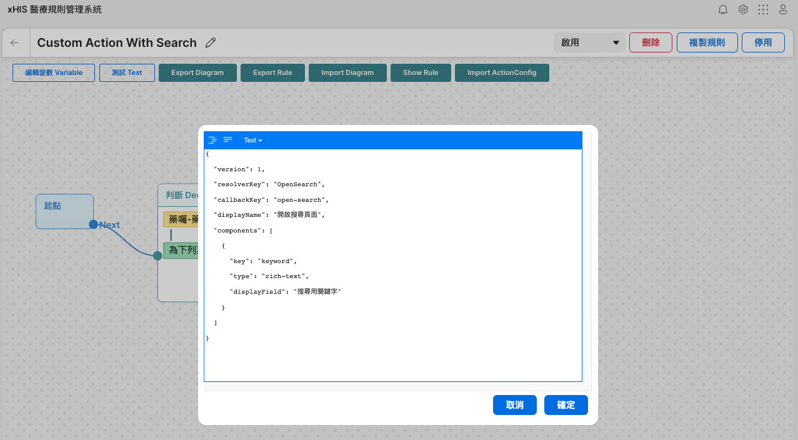

5. 將以下的設定貼到裡面，並且按確定。

   ```json
   {
     "version": 1,
     "resolverKey": "OpenSearch",
     "callbackKey": "open-search",
     "displayName": "開啟搜尋頁面",
     "components": [
       {
         "key": "keyword",
         "type": "rich-text",
         "displayField": "搜尋用關鍵字"
       }
     ]
   }
   ```

6. 在 Import 之後，點擊「新增處理 Process」之後，你會看到處理類型中有剛剛加入的「開啟搜尋頁面」，而「開啟搜尋頁面」就是上面設定中的 `displayName`。
7. 在這個例子中有兩種藥會需要開這個搜尋，我們需要知道當下是哪個藥，所以會使用到變數，要使用到變數的話，就要使用 `rich-text` 的 Type。要使用變數的時候，在欄位輸入 `@` 後就會跳出選項可以設定。

   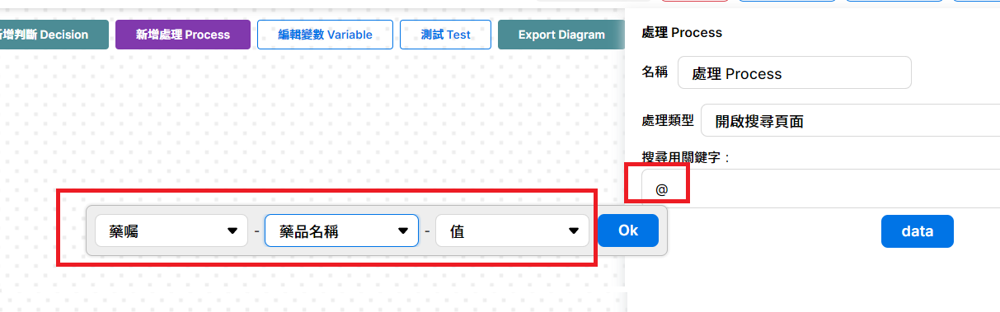

8. 填好以上資料後按「啟用」。

   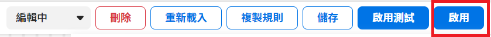

9. 回到 Tutorial 5，點擊一個病人且進入藥囑清單。我們輸入 `bokey` 來搜尋(`drugCode BOK01O`). 在點擊搜尋結果後，你就會開啟一個 Google Search 的畫面且關鍵字為這個藥的名字。
10. 「開啟搜尋頁面」的處理的程式在 `src/tutorials/tutorial_5/widgets/drugList/drugList.vue:L431`。`OpenSearch` 就是上面設定的 `resolverKey` 然後這 Function 的參數 `resultData.result.keyword` 就會是上面設定用到的「藥囑-藥品名稱-值」。

    <<< @/../src/tutorials/tutorial_5/widgets/drugList/drugList.vue#OpenSearch{ts}

11. 如果對於自定義 Action 有更多興趣，請參考[自定義 Action 的詳細介紹](https://github.com/ASUS-AICS/xhis-rule-schema/tree/master/src/actions)來獲得更多資訊。

## 學到了什麼

1. 如何觸發特定 `TriggerType` 的規則。
2. 如何處理規則運算完後要執行的 Action。
3. 如何使用自定義的 Action。

## 作業

1. 新增一個自定義的 Action 「SearchICD」，並且建立一條使用此 Action 的規則。
2. 在 ICD 的 Widget，針對`診斷碼-編碼` 內**開頭數字為A的編碼** 開啟搜尋頁面，用 `診斷碼-編碼` 在 Google 做搜尋。

## 參考

1. [規則服務架構說明](https://asus.sharepoint.com/:w:/s/HIS/ET4l-nqvOIFCv2sX4VxsBx0B3hPcwZBfgKa5eOE7m5GfBA?e=bCd1NC)
2. [規則編輯器的操作手冊](https://aicswiki.azurewebsites.net/en/project/saas-his/xHis/rule-configurator-operation-manual)
3. [自定義action的詳細介紹](https://github.com/ASUS-AICS/xhis-rule-schema/tree/master/src/actions)
4. [規則服務的API說明](https://aicswiki.azurewebsites.net/en/project/saas-his/xHis/Guideline/new-page)
5. Rule Related SDK
