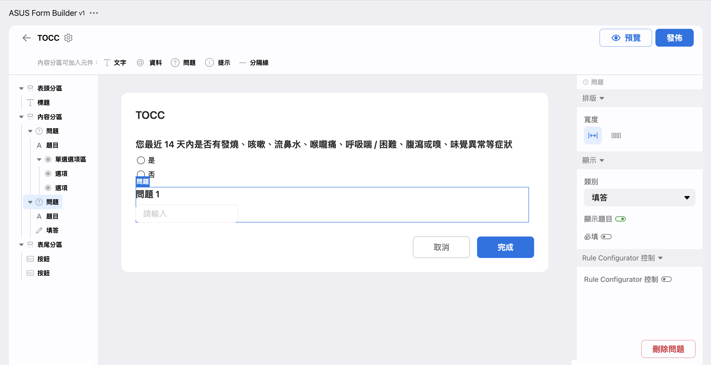
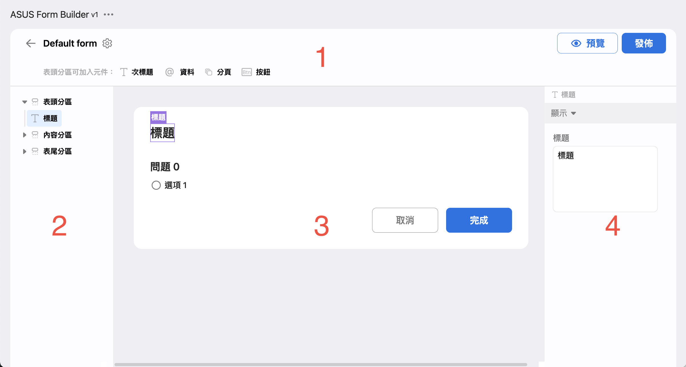
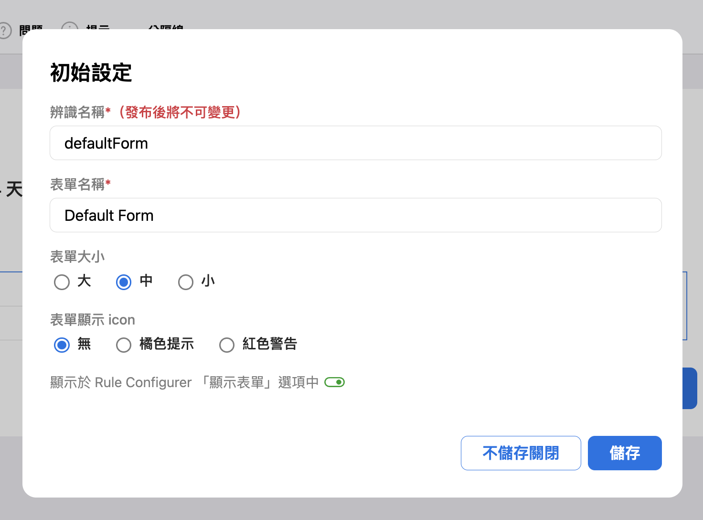
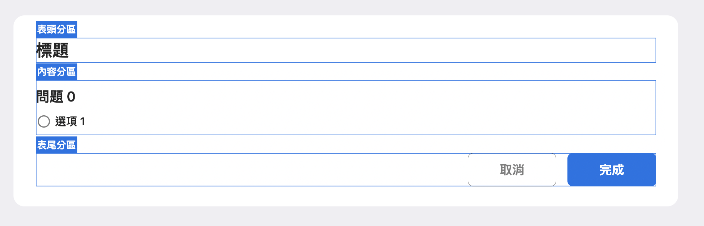
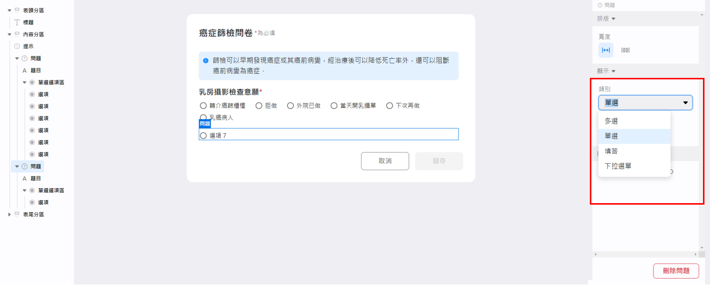
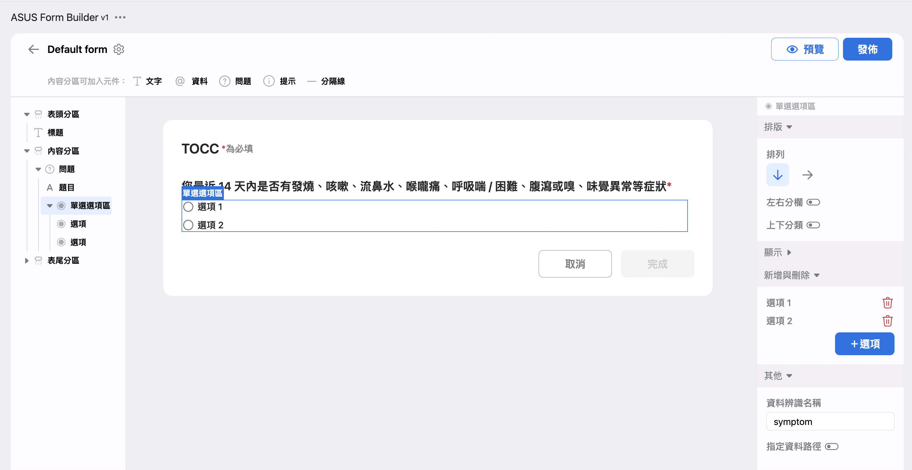
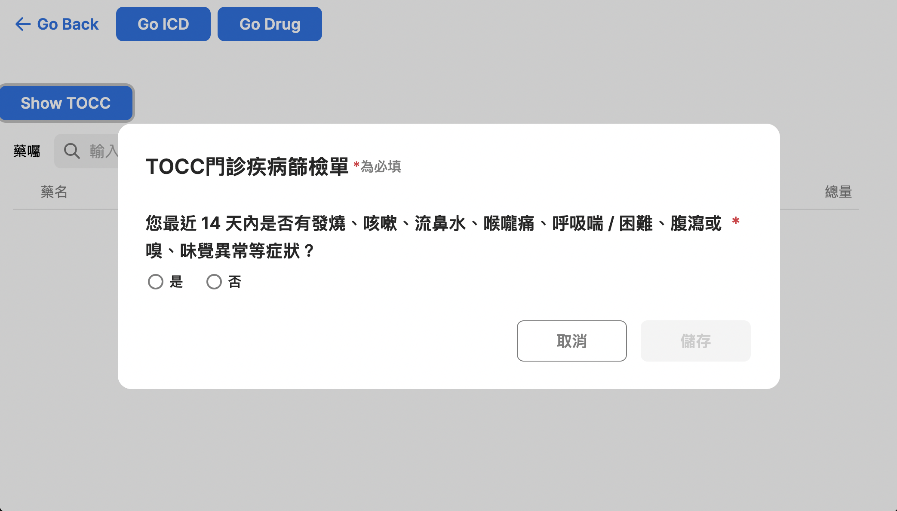
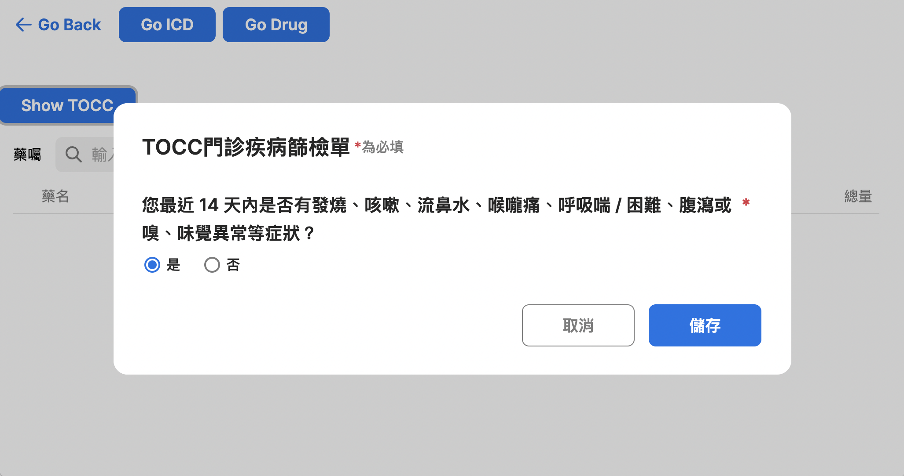
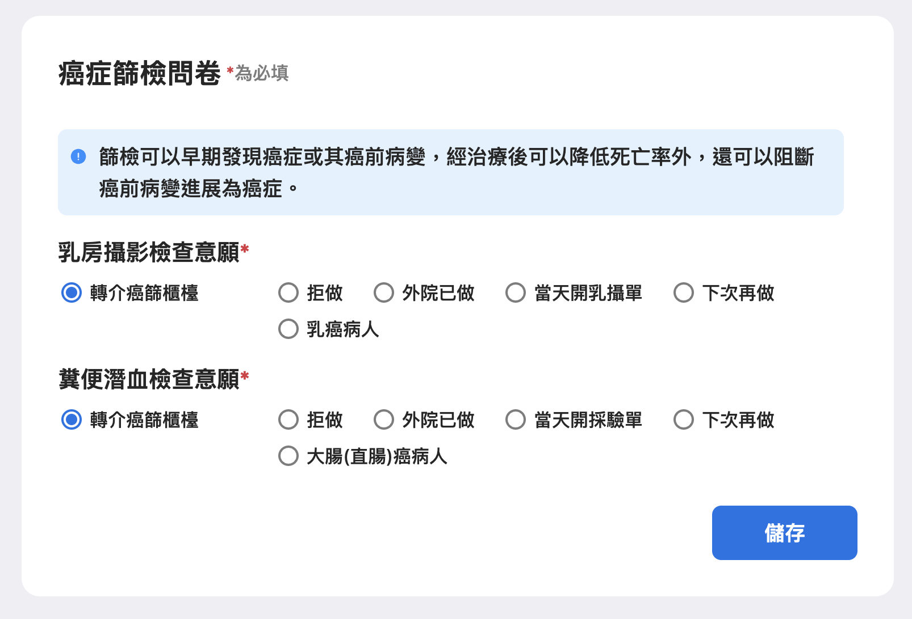

# Form Builder

## 簡介

在 xHIS 裡，表單與 Widget 是不同的，我們不會使用 xUI 來實作出"表單"面貌的 Widget，若你有使用表單的需求，應該使用本篇所提的 Form Builder來 建立表單。

## 目標

瞭解如何建立表單，並透過 Widget 或是 Rule Engine 顯示。表單可以讓使用者填寫並儲存，或在需要時顯示先前填寫的結果。本次教學也會包含如何根據病人不同顯示客製化的表單。

## 內容

### Form Builder 使用手冊

此手冊介紹了基本的概念與使用方法。本教學後續會介紹建立表單的詳細操作方式。

[使用手冊](https://asus.sharepoint.com/:p:/r/sites/AICS470/_layouts/15/Doc.aspx?sourcedoc=%7B2EAFFEF8-A14B-4940-A498-2667CC5992E4%7D&file=Form%20Builder%20%E4%BD%BF%E7%94%A8%E6%89%8B%E5%86%8A.pptx&action=edit&mobileredirect=true)

### 利用 Form Builder 建立簡易的表單

接下來將介紹如何一步步建立 TOCC（Travel history, Occupation, Contact history, Cluster）表單，在本段教學結束後，您將建立如圖所示的表單：

> 💡 在開始教學之前，請先將 `.env.local` 中  `VITE_TUTORIAL_INDEX=` 設置為 `6`。



1. 打開 [Online Form Builder](https://xhis-playground-dev.southeastasia.cloudapp.azure.com/web/formv1)，點擊「＋新表單」按鈕來建立新表單。
2. 接下來畫面會轉跳到表單編輯器。表單編輯器主要有四個區域：

   

   1. **工具列**：可以設定表單設定（左上角的齒輪圖示），加入不同元件，如問題、次標題等（可加入元件會根據選擇區域不同而改變）。工具列也提供「預覽」與「發佈」按鈕。
   2. **導覽區**：表單是以巢狀的元件組成的，您可以透過點擊三角形的箭頭以展開元件，並點擊元件名稱以選擇該元件。
   3. **預覽區**：您可以在此預覽表單的樣式，並且透過直接點擊表單元件以選擇它。被選中的元件會以方框標記。若不容易精準的選中元件，您可以透過導覽區直接選擇。
   4. **細節設置區**：你可以於此設定選中元件的屬性。變動會立即套用並顯示在預覽區。

3. 請打開表單設定（點選左上角的齒輪圖示）。變動將在儲存後套用。

   

   - `辨識名稱` 是程式用以識別該表單的 ID，後續教學會介紹如何使用此 ID。
   - `表單名稱` 是我們用以識別表單的名稱，會呈現在 Rule Configurator 中，供設定時選取使用。
   - `表單索引` 定義了如何找尋現存資料，並在資料不存在時判斷是否需要儲存新的回覆。如果選擇了 `病患`，則每位病人僅會留存最新一筆回覆，並覆蓋舊的回覆（但紀錄會留存）。如果選擇了 `門診藥囑`，則每個病人每次門診的不同的藥囑，都會對應到一筆回覆。
   - `顯示於 Rule Configurator 「顯示表單」選項中` 將會控制此表單能不能於 Rule Configurator 中選取。無論此選項開啟與否，都能透過 Widget 顯示。

4. 當設定 `辨識名稱` 時有些注意事項：
   - 僅能由由英文大小寫、數字、減號（`-`）、底線（`_`）組成
   - 必須由英文字開頭
   - 盡量按照 `<分類>-<名稱>` 的方式命名，並使用已使用的分類如 `rule`、`form` 等，且能清楚辨識出此表單的功能。以 **lower camel case** ([wiki](https://en.wikipedia.org/wiki/Camel_case)) 命名。如：`rule-doseAduit`。

5. 將 `辨識名稱` 設定為 `playground-TOCC`，並按 `儲存` 按鈕關閉設定彈窗.
6. 如手冊中介紹，表單分為三個區塊：`表頭分區`、`內容分區`、`表尾分區`。每個區塊都有不同的功用。

   

7. 在【預覽區】中點擊以選擇標題。您可以在【細節設置區】中編輯標題。將其編輯成 `TOCC`。
8. 在【預覽區】中點擊 `問題 0` 以選擇題目標題（若不易選中，可以從【導覽區】中選取）。您將可以設定問題的 `標題`。請設定為「您最近 14 天內是否有發燒、咳嗽、流鼻水、喉嚨痛、呼吸喘 / 困難、腹瀉或嗅、味覺異常等症狀」。
9. 在【預覽區】中點擊 `問題 0`，或【導覽區】的問題。您可以在【細節設置區】中看到「類別」、「必填」等屬性。

   

10. 請打開 `必填`。您會發現 `表尾分區` 的 `完成` 按鈕立即被停用，代表必填問題尚未全部填寫完畢。在問題標題後的 `*` 號代表此題必填。
11. 請選取【導航區】中的 `單選選項區`（若找不到，可以點選三角型箭頭展開）。現在您可以透過 `＋選項` 按鈕添加新選項。請試著添加一個選項。
12. 在 `單項選項區`，現在來編輯 `資料辨識名稱` 。 `資料辨識名稱` 代表如何儲存此資料。您可以將其表單填答結果視作一個 JSON 物件，`資料辨識名稱` 即是儲存此資料的鍵值。舉例來說，若您將其設定為 `symptom`，則填答結果會是 `{"symptom": "someChoice"}`。`資料辨識名稱` 有著與表單的 `辨識名稱` 相似的限制，因為他直接影響了儲存資料的方式。
    - 僅能由由英文大小寫、數字、底線 (`_`) 組成 （不含減號 (`-`)）
    - 必須由英文字開頭
13. 在上述步驟後，您應會得到如下的表單

    

14. 請點擊【預覽區】中的選項。您可以於【細節設置區】編輯 `選項名稱` 與 `資料回傳值`。將兩個選項的 `選項名稱` 分別設定為 `是`, `否` ，並修改 `資料回傳值`為 `true` 和 `false`。
15. 現在我們完成的一個問題的設定。若要增加更多的問題，請點擊【工具列】中的 `問題` 以加入新問題。
16. Click `預覽` button in the tool bar. Now you could select options or input text to the questions.
17. Click `發布`, then the form will be saved. You will able to find your form in the form list in the [Form Builder](https://xhis-playground-dev.southeastasia.cloudapp.azure.com/web/formv1/).

### 使 Widget 顯示表單

1. 在終端內執行

   ```sh
   npm run dev
   ```

2. 打開 <http://localhost:5173> 。請選擇其中的 Tutorial 6。
3. 此範例將會說明如何顯示表單，並已經預先建立一個 `辨識名稱` 為 `tutorial-TOCC` 的表單。

   - `FormDialog` (`src/tutorials/tutorial_6/FormDialog.vue`) 元件已經預先被掛載在 `drug` 頁面(`src/tutorials/tutorial_6/Drug.vue`)下以顯示表單。
   - 我們利用 `useForm` (`src/tutorials/tutorial_6/composable/useForm.ts`) composable 來顯示表單。這個 composable 做的事相當簡單：利用 emitter 來觸發 `FormDialog` 中的 `onShowForm` 函式。
   - `useForm` composable 未來將直接包含於函式庫中，且顯示表單所需的環境 (如 `FormDialog` 元件) 都會預先在平台上設定完成。
   - 在 `src/tutorials/tutorial_6/widgets/drugList/ToccForm.vue` 中，我們建立了一個按鈕，在按下後將顯示 `tutorial-TOCC` 的表單。

4. 請打開任意一個病人的 `drug` 頁面。您會看到頁面上有一個 `顯示 TOCC` 按鈕。點擊後將顯示 TOCC 表單。

   

5. 在上述步驟，顯示表單的環境已被預先搭建，搭建的方式如下：

   1. 表單使用了 `windicss` 套件 (官方網站: windicss.org) 來提供正確的 CSS。Windicss 配置檔 (`windicss.config.ts`) 被設定能夠支援 `@asus-aics/xhis-form-builder-v1` 套件。

      <<< @/../windicss.config.ts#windicss

   2. 在 `vite.config.ts` 中註冊 Windicss 插件。

      <<< @/../vite.config.ts#windicss

   3. 在 `src/main.ts` 中匯入 css 樣式。

      <<< @/../src/main.ts#windicss

   4. 在 `src/tutorials/tutorial_6/Drug.vue` 中掛載 `FormDialog` 元件。當元件被掛載後，他將能聆聽 `useForm` composable 所發出的顯示表單事件。
   5. 最後，`useForm` composable 就能如第 3 步中所描述的方法顯示表單。

### 顯示過去填寫的表單填答

1. 在 Widget 中，點擊 <XButton size="sm">顯示 TOCC</XButton>，填入任意資料後點擊 `儲存` 按鈕。
2. 特別要注意一點：在 `src/tutorials/tutorial_6/widgets/drugList/ToccForm.vue` 中，`loadMode` 被設定為 `Valid`。這代表表單將會嘗試讀取過去填寫的資料。

    <<< @/../src/tutorials/tutorial_6/widgets/drugList/ToccForm.vue#loadMode{ts}

3. 再次點擊 <XButton size="sm">顯示 TOCC</XButton>，您會看到剛剛填寫的結果。

   

### 從 Component 或是 API 直接獲取資料

1. 您可以直接透過元件取得資料。在瀏覽器中利用 F12 打開開發人員工具，並再次打開與填寫表單。
2. 您會在主控台中看到 `form result: …` 的紀錄。
3. 這筆紀錄是 `ToccForm.vue` 記錄的。您可以直接使用 `fillform` 函數的回傳值。

   <<< @/../src/tutorials/tutorial_6/widgets/drugList/ToccForm.vue#formResult

4. (進階) 您也可以利用 API 存取填答結果。以下為利用 `curl` 的範例。您必須要先在標頭檔中指定 `authorization`（可以利用開發人員工具觀看「網路」分頁中要求的標頭）、`formId` 以及 `patientId`。`formId` 必須要是表單的 `識別名稱`。

   ```sh
   curl --header "authorization: TOKEN" 'https://xhis-playground-dev.southeastasia.cloudapp.azure.com/api/form/record?formId=testForm1&patientId=A1234'
   ```

   您會收到該病人的填答結果：

   ```json
   {
    "formId": "testForm1",
    "data": {
      "field1": "value1",
      "field2": "value2",
    }
    // …
   }
   ```

### 建立規則以顯示不同的表單內容

1. 範例規則已經建立好了：打開[這條規則](https://xhis-playground-dev.southeastasia.cloudapp.azure.com/web/rule/rule-editor?serialNo=230105001&timestamp=1672892009933&isText=false)
2. 這條規則的意思是：當開立 `FOR01I` 藥囑時，顯示表單以做額外的確認。與性別有關的選項將根據性別而被停用。
3. [這一張](https://xhis-playground-dev.southeastasia.cloudapp.azure.com/web/formv1/builder?name=drugAudit-Teriparatide&version=3)是顯示的表單

### 觸發規則並顯示表單

1. 規則的 handler 已經在 `src/tutorials/tutorial_6/widgets/drugList/drugList.vue` 中加好了。您可以參考 `['ShowForm'] =` 開始的程式。這裡也是使用 `useForm` 顯示表單。
2. 讓我們來測試這條規則。打開 [Tutorial 6](http://localhost:5173/tutorial-6)，並選擇任意病人的 `drug` 頁面。
3. 開立 `Forteo Inj 28d/2.4ml#` 藥囑。這個藥就是前述的 `FOR01I` 藥囑。開立後將顯示表單。

## **學到了什麼**

- 基本的 Form Builder 使用方式
  - 如何利用 Form Builder 建立簡單的表單
  - 如何修改 Widget 以顯示表單
  - 如何顯示過去填寫的表單填答
  - 如何透過元件或 API 取得表單填答
- 與 Rule Engine 互動
  - 如何建立規則以顯示不同的表單內容
  - 如何觸發規則並顯示表單

## 作業

- 建立癌症篩檢意願調查單

  

  - 將兩個問題的 `資料辨識名稱` 分別設定為 `mammo`, `rectum`
  - 將每個選項的 `值` 根據選項文字設定為

  | 選項文字 | 值 |
  |-------|-------|
  | 轉介癌篩櫃檯 | referral  |
  | 拒做 | refuse  |
  | 外院已做 | doneExternal  |
  | 當天開乳攝單 | inProgress  |
  | 當天開採驗單 | inProgress  |
  | 下次再做 | defer |
  | 乳癌病人 | diagnosed |
  | 大腸(直腸)癌病人 | diagnosed |

- 建立 <XButton size="sm">顯示癌症篩檢意願調查單</XButton> Widget 以直接顯示表單
  - 打開表單、填寫並儲存結果
- 建立一條顯示表單的規則
  - 當病人 ID 為 `TAI-017` 或 `TAI-019` 並開立任何藥囑時顯示表單
  - 根據病人性別顯示客製化的表單。當病人為男性時，隱藏 `乳房攝影檢查意願` 問題。
- 修改 Tutorial 6 與規則，使得規則能在打開病患的 ICD 頁面時就直接顯示，而不用開立藥囑。

<script setup>
import { XButton } from '@asus-aics/xui';
</script>
