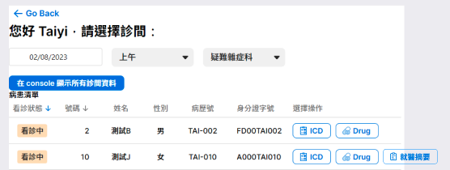
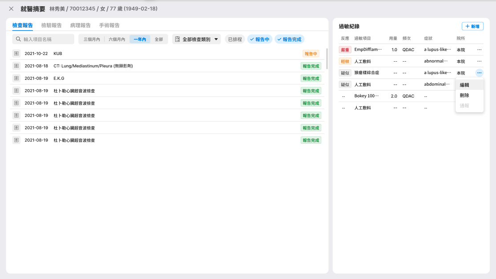
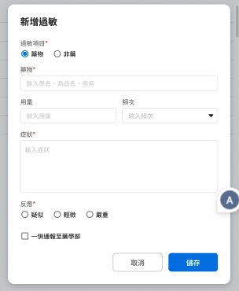
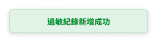

# Final Project

## 目標

完成就醫摘要。

以 Tutorial 6 的作業基礎，延伸出就醫摘要功能，該功能可以查看 `檢驗檢查報告`、`病理報告`、`手術報告` 以及 `過敏紀錄`，並對過敏紀錄進行讀取、新增、編輯、刪除功能(CRUD)。

## UI 設計

請參考 UI 流程設計: [Figma](https://www.figma.com/file/WQg05GH3Vt1LiO9b6V6ucy/Widget-SDK?node-id=1%3A2&t=aLJIRxiNI6SmRgAb-0)

目前 `檢驗檢查報告`、`病理報告`、`手術報告` 這三個 tab，可以先以空白頁面呈現

## 功能需求及技術細節

1. 增加 `就醫摘要` 入口
   

   - 在 Tutorial-6 的病患清單項目中，加入一個 "就醫摘要" 入口按鈕

2. 點擊 `就醫摘要`，跳出就醫摘要畫面
   

   - 使用 `xDialogue` 來做整體視窗的跳出
   - 使用 `檢驗檢查報告API` 來取得報告清單
   - 使用 `過敏紀錄API` 來取得過敏紀錄清單

3. 在 `就醫摘要` 裡面能支援過敏紀錄的 CRUD 功能，並依 UI 設計顯示執行結果提示
   
   

   - 使用 Form Builder 來建立編輯表單
   - 使用 `過敏紀錄API` 可以進行該病患的過敏紀錄 CRUD 操作
   - 使用 `xToast` 來顯示執行結果

## API

對應功能的 API 如下：

- 過敏記錄 https://xhis-docs.azurewebsites.net/main#tag--allergyIntolerance
- 檢驗檢查報告: https://xhis-docs.azurewebsites.net/main#tag--report
- 病理報告: https://xhis-docs.azurewebsites.net/main#tag--pathology
- 手術報告: https://xhis-docs.azurewebsites.net/main#tag--operation

## 可能會使用到的 xUI 元件

- `XButton`
- `XChip`
- `XChipGroup`
- `XDialogue`
- `XDropdown`
- `XFloatingWindow`
- `XIcon`
- `XIconButton`-XList
- `XNavTab`
- `XSelect`
- `XSlideTabs`
- `XStatus`
- `XTable`
- `XTag`
- `XTooltip`
- `XToast`

## 學到了什麼

- 拆解目標需求，分析技術細節及所需要的元件和 API 支援
- 學習了解 UI 設計語言，轉換成實際程式碼產出
- 更深入地整合 xUI、Form Builder
